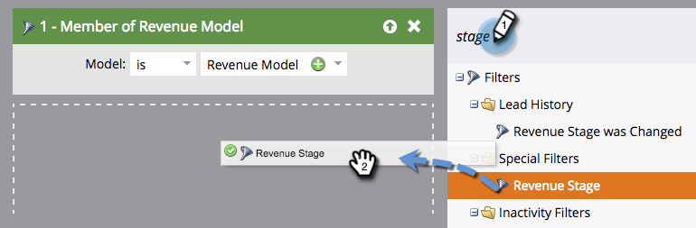

# Sök efter alla leads i en intäktscykelmodell {#find-all-leads-in-a-revenue-cycle-model}

Genom att använda smarta listor kan du enkelt hitta alla medlemmar i intäktscykelmodellen.

>[!PREREQUISITES]
>
>[Skapa en smart lista](/help/marketo/product-docs/core-marketo-concepts/smart-lists-and-static-lists/creating-a-smart-list/create-a-smart-list.md)

1. Markera den smarta listan och klicka på fliken **Smart lista**.

   

1. Hitta filtret **Medlem i intäktsmodell** och dra det till arbetsytan.

   

1. Välj en **modell**.

   

   Då får ni alla tips i den modellen, oavsett fas. Vanligtvis vill du ha en specifik scen. Använd följande filter i stället.

1. Hitta filtret **Intäktsstadium** och dra det till arbetsytan.

   

1. Välj en **scen**.

   

1. Gå till fliken **Leads** för att visa resultaten.

   

   >[!TIP]
   >
   >Du behöver inte båda filtren, bara välja det du behöver. Vi visar er båda för att vara noggranna.

   >[!CAUTION]
   >
   >Om en leds stadium ändras av en extern kampanj när leadet skapas första gången, loggas ingen aktivitet i databasen. Detta innebär att leadet inte tas med i det smarta listfiltret.
