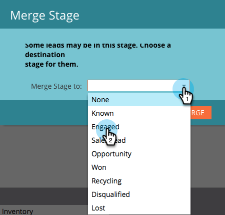

# Sammanfoga två steg i intäktsmodelleraren {#merging-two-stages-in-the-revenue-modeler}

När du har godkänt modellen kan du inte ta bort faser när du redigerar ett utkast. I stället kan du sammanfoga scenen med en annan.

1. Klicka på **Marketo Home** och välj **Analytics**.

   

1. Klicka på den godkända modellen.

   

1. Klicka på **Redigera utkast.**

   

1. `Right click the stage you want to merge and select`**`Merge Stage`**`in the menu.`

   

1. Klicka på den specifika scenen i listrutan.

   

1. `You can re-approve the model by selecting`**`Approve Model Draft`**` in the **Model Actions** menu.`

   ` 

   `

>[!NOTE]
>
>Välj **Ingen** i listrutan Sammanfogningsscen för att ta bort leads från modellen

