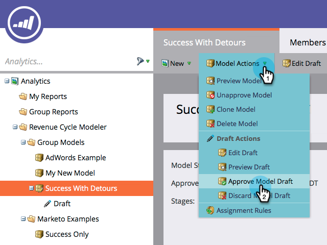

# Sammanfoga två steg i intäktsmodelleraren {#merging-two-stages-in-the-revenue-modeler}

När du har godkänt modellen kan du inte ta bort faser när du redigerar ett utkast. I stället kan du sammanfoga scenen med en annan.

1. Klicka **Marketo Home** och markera **Analyser**.

   

1. Klicka på den godkända modellen.

   

1. Klicka **Redigera utkast.**

   

1. Högerklicka på den scen som du vill sammanfoga och välj **Sammanfoga scen** på menyn.

   

1. Klicka på den specifika scenen i listrutan.

   

1. Du kan omgodkänna modellen genom att välja **Godkänn modellutkast** i **Modellåtgärder** -menyn.

   

>[!NOTE]
>
>Välj **Ingen** i listrutan Sammanfogningsscen för att ta bort leads från modellen
