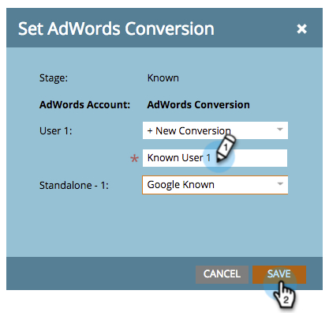
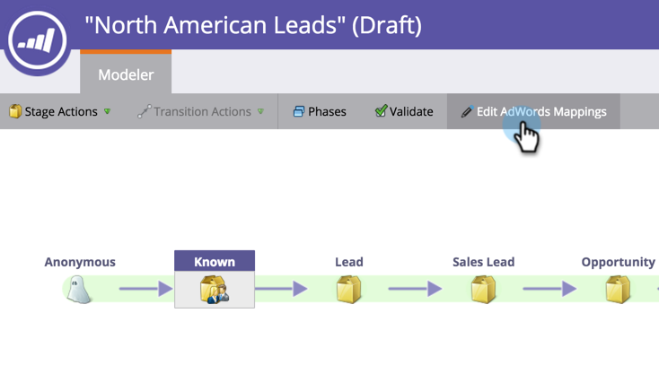

# Ange Google AdWords-konverteringar i intäktsmodellen med ett hanterarkonto {#set-google-adwords-conversions-in-the-revenue-model-with-a-manager-account}

Länka ditt Google AdWords-konto till Marketo för att automatiskt överföra konverteringsdata offline från Marketo till Google AdWords. Sedan kan du från gränssnittet för AdWords enkelt se vilka klick som resulterat i kvalificerade leads, affärsmöjligheter och nya kunder (eller vilka intäktssteg du vill spåra) efter att du har [lagt till anpassade kolumner](https://support.google.com/adwords/answer/3073556) i AdWords.

Om du har flera Google Adwords-konton kan du använda ett [Google AdWords Manager-konto](https://www.google.com/adwords/manager-accounts/) (tidigare Mitt klientcenter) för att integrera dem med Marketo.

Du kan mappa AdWords offlinekonverteringar till en eller flera steg i en intäktsmodell. Det finns två sätt:

* Scenåtgärd
* AdWords-mappning

>[!PREREQUISITES]
>
>* [Lägg till Google AdWords som en startpunktstjänst med ett hanterarkonto](../../../../product-docs/administration/additional-integrations/add-google-adwords-as-a-launchpoint-service-with-a-manager-account.md)

>

## Använd scenåtgärd {#use-stage-action}

Mappa en AdWords-konvertering under Stage-åtgärder.

1. Välj det steg som du vill mappa till en AdWords-konvertering.

   

1. Under listrutan **Stage Actions** väljer du **Set AdWords Conversion**.

   

1. Ange en **AdWords-konvertering**.

   >[!NOTE]
   >
   >Du kan välja olika AdWords-konverteringar för varje underordnat konto.

   

   Tips: Om du inte har några AdWords-konverteringar skapar du en genom att klicka på **+Ny konvertering**.

   

1. Klicka på **Spara**.

   

1. När du är klar med att mappa alla dina AdWords-konverteringar till intäktsfaser går du tillbaka till sammanfattningssidan. Välj **Modellåtgärder** och välj **Godkänn steg**.

   

## Proffstips: Lägg till en ny konvertering {#pro-tip-add-a-new-conversion}

Proffstips! En ny offlinekonvertering för AdWords kan skapas från Marketo.

>[!CAUTION]
>
>Nya konverteringar som skapats från Marketo har optimeringsinställningen aktiverad. Det innebär att AdWords anbudsstrategier kan optimera dina bud för dessa konverteringar. Du kan ändra den här inställningen från ditt AdWords-konto.

1. Under listrutan **Stage Actions** väljer du **Set AdWords Conversion**.

   

1. Välj **Ny konvertering**.

   ** 

   **

1. Ange ett **konverteringsnamn**. Klicka på **Spara**.

   

   Underbar! Den nya konverteringen visas i ditt AdWords-konto.

## Använd AdWords-mappning {#use-adwords-mapping}

Du kan koppla alla dina modellfaser till din AdWords-konvertering på ett och samma ställe med hjälp av AdWords Mappings.

1. Välj **Redigera AdWords-mappningar**.

   

1. Välj önskat **AdWords-konto** och önskad **AdWords-konvertering** för varje scen som du vill spåra.

   

1. När du har mappat dina faser klickar du på **Spara**.

   

1. När du är klar med att mappa alla dina AdWords-konverteringar till intäktsfaser går du tillbaka till sammanfattningssidan. Välj **Modellåtgärder** och välj **Godkänn steg**.

   

Om du vill visa offlinekonverteringsdata måste du logga in på ditt AdWords-konto. Vi rekommenderar att du använder deras [anpassade kolumnfunktion](https://support.google.com/adwords/answer/3073556) för att skapa konverteringsräkningskolumner för varje offlinekonvertering som du importerar från Marketo.
