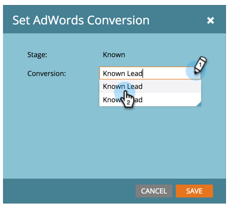

# Ange [!DNL Google AdWords]-konverteringar i intäktsmodellen {#set-google-adwords-conversions-in-the-revenue-model}

Länka ditt [!DNL Google AdWords]-konto till Marketo för att automatiskt överföra offlinekonverteringsdata från Marketo till [!DNL Google AdWords]. Från gränssnittet [!DNL AdWords] kan du sedan enkelt se vilka klick som resulterat i kvalificerade leads, affärsmöjligheter och nya kunder (eller vilka intäktssteg du vill spåra) efter att du [lagt till anpassade kolumner](https://support.google.com/adwords/answer/3073556) i [!DNL AdWords].

>[!NOTE]
>
>Detta är en push-integrering från Marketo till [!DNL Google AdWords]. Konverteringsdata visas _endast_ i din [!DNL Google AdWords]-portal, _inte i Marketo-gränssnittet_.

Läs mer om [Google importfunktion för offlinekonvertering](https://support.google.com/adwords/answer/2998031?hl=en). Mappa [!DNL AdWords] offlinekonverteringar till en eller flera faser i en intäktsmodell. Det finns tre sätt att mappa:

* Konvertering av [!DNL AdWords]
* Scenåtgärd
* [!DNL AdWords]-mappning

Du kan skapa en ny offlinekonvertering för [!DNL AdWords] från Marketo om du använder Stage Action.

>[!PREREQUISITES]
>
>[Lägg till [!DNL Google AdWords] som en LaunchPoint-tjänst](/help/marketo/product-docs/administration/additional-integrations/add-google-adwords-as-a-launchpoint-service.md)

## Använd konvertering av [!DNL AdWords] {#use-adwords-conversion}

1. Gå till området **[!UICONTROL Analytics]**.

   

1. Välj en modell.

   

1. Klicka på **[!UICONTROL Edit Draft]**.

   

1. Välj den intäktsfas som du vill mappa till en [!DNL AdWords]-konvertering.

   

1. Markera **[!UICONTROL AdWords Conversion]** som du vill mappa till din Marketo-scen.

   

   Snyggt! Konverteringsdata för [!DNL AdWords] överförs till din [!DNL Google AdWords] vid den tidpunkt du valde.

## Använd scenåtgärd {#use-stage-action}

Du kan också mappa en [!UICONTROL AdWords Conversion] under **[!UICONTROL Stage Actions]**.

1. Välj det steg som du vill mappa till en [!DNL AdWords]-konvertering.

   

1. Välj **[!UICONTROL Stage Actions]** i listrutan **[!UICONTROL Set AdWords Conversion]**.

   

1. Välj en **[!UICONTROL AdWords Conversion]**.

   

   **Tips**: Om du inte har några [!DNL AdWords]-konverteringar skapar du en genom att klicka på **[!UICONTROL +New Conversion]**.

   

1. Klicka på **[!UICONTROL Save]**.

   

1. När du har mappat alla dina [!DNL AdWords]-konverteringar till intäktsfaser går du tillbaka till sammanfattningssidan. Markera **[!UICONTROL Model Actions]** och välj **[!UICONTROL Approve Stages]**.

   

## Proffstips: Lägg till en ny konvertering {#pro-tip-add-a-new-conversion}

Proffstips! En ny offlinekonvertering för [!DNL AdWords] kan skapas från Marketo.

>[!CAUTION]
>
>Nya konverteringar som skapats från Marketo har &quot;optimeringsinställningen&quot; aktiverad. Det innebär att [!DNL AdWords] anbudsstrategier tillåts optimera dina bud för dessa konverteringar. Du kan ändra den här inställningen från ditt [!DNL AdWords]-konto.

1. Välj **[!UICONTROL Stage Actions]** i listrutan **[!UICONTROL Set AdWords Conversion]**.

   

1. Välj **[!UICONTROL New Conversion]**.

   

1. Ange **[!UICONTROL Conversion Name]**. Klicka på **[!UICONTROL Save]**.

   

   Underbar! Den nya konverteringen visas i ditt [!DNL AdWords]-konto.

## Använd [!DNL AdWords]-mappning {#use-adwords-mapping}

Du kan associera alla dina modellfaser med [!UICONTROL AdWords Conversion] på en plats med hjälp av [!DNL AdWords]-mappningar.

1. Välj **[!UICONTROL Edit AdWords Mappings]**.

   

1. Välj önskad **[!UICONTROL AdWords Conversion]** för varje scen som du vill spåra.

   

1. När du har mappat dina faser klickar du på **[!UICONTROL Save]**.

   

1. När du har mappat alla dina [!DNL AdWords]-konverteringar till intäktsfaser går du tillbaka till sammanfattningssidan. Markera **[!UICONTROL Model Actions]** och välj **[!UICONTROL Approve Stages]**.

   

Om du vill visa offlinekonverteringsdata måste du logga in på ditt [!DNL AdWords]-konto. Vi rekommenderar att du använder deras [anpassade kolumnfunktion](https://support.google.com/adwords/answer/3073556) för att skapa konverteringskolumner för varje offlinekonvertering som du importerar från Marketo.
