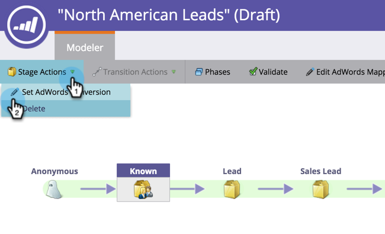

# Ange Google AdWords-konverteringar i intäktsmodellen {#set-google-adwords-conversions-in-the-revenue-model}

Länka ditt Google AdWords-konto till Marketo för att automatiskt överföra offlinekonverteringsdata från Marketo till Google AdWords. Sedan kan ni utifrån AdWords-gränssnittet enkelt se vilka klick som resulterat i kvalificerade leads, möjligheter och nya kunder (eller vilka intäktssteg ni vill spåra) efter er [lägga till egna kolumner](https://support.google.com/adwords/answer/3073556) i AdWords.

>[!NOTE]
>
>Det här är en push-integrering från Marketo till Google AdWords. Konverteringsdata visas _endast_ på din Google AdWords-portal, _inte i Marketo användargränssnitt_.

Läs mer om [Google importfunktion för offlinekonvertering](https://support.google.com/adwords/answer/2998031?hl=en). Mappa AdWords-offlinekonverteringar till en eller flera steg i en intäktsmodell. Det finns tre sätt att mappa:

* Konvertering av ord
* Scenåtgärd
* AdWords-mappning

Du kan skapa en ny offlinekonvertering för AdWords från Marketo om du använder Stage Action.

>[!PREREQUISITES]
>
>[Lägg till Google AdWords som en LaunchPoint-tjänst](/help/marketo/product-docs/administration/additional-integrations/add-google-adwords-as-a-launchpoint-service.md)

## Använd AdWords-konvertering {#use-adwords-conversion}

1. Gå till **Analyser** område.

   

1. Välj en modell.

   

1. Klicka **Redigera utkast**.

   

1. Välj det intäktsstadium som du vill mappa till en AdWords-konvertering.

   

1. Välj **Konvertering av ord** du vill kartlägga din Marketo-scen.

   

   Snyggt! Dina konverteringsdata för AdWords kommer att överföras till dina Google AdWords vid den surfning du valt.

## Använd scenåtgärd {#use-stage-action}

Du kan också mappa en AdWords-konvertering under Stage-åtgärder.

1. Välj det steg som du vill mappa till en AdWords-konvertering.

   

1. Under **Scenåtgärder** listruta, välja **Ange konvertering av AdWords**.

   

1. Välj en **Konvertering av ord**.

   

   **Tips**: Om du inte har några AdWords-konverteringar skapar du en genom att klicka på **+Ny konvertering**.

   

1. Klicka **Spara**.

   

1. När du är klar med att mappa alla dina AdWords-konverteringar till intäktsfaser går du tillbaka till sammanfattningssidan. Välj **Modellåtgärder** och välja **Godkänn steg**.

   

## Proffstips: Lägg till en ny konvertering {#pro-tip-add-a-new-conversion}

Proffstips! En ny offlinekonvertering för AdWords kan skapas från Marketo.

>[!CAUTION]
>
>Nya konverteringar som skapats från Marketo har &quot;optimeringsinställningen&quot; aktiverad. Det innebär att AdWords anbudsstrategier kan optimera dina bud för dessa konverteringar. Du kan ändra den här inställningen från ditt AdWords-konto.

1. Under **Scenåtgärder** listruta, välja **Ange konvertering av AdWords**.

   

1. Välj **Ny konvertering**.

   

1. Ange **Konverteringsnamn**. Klicka **Spara**.

   

   Underbar! Den nya konverteringen visas i ditt AdWords-konto.

## Använd AdWords-mappning {#use-adwords-mapping}

Du kan koppla alla dina modellfaser till din AdWords-konvertering på ett och samma ställe med hjälp av AdWords Mappings.

1. Välj **Redigera AdWords-mappningar**.

   

1. Markera önskat **Konvertering av ord** för varje scen som du vill spåra.

   

1. När du har mappat dina faser klickar du på **Spara**.

   

1. När du är klar med att mappa alla dina AdWords-konverteringar till intäktsfaser går du tillbaka till sammanfattningssidan. Välj **Modellåtgärder** och välja **Godkänn steg**.

   

Om du vill visa offlinekonverteringsdata måste du logga in på ditt AdWords-konto. Vi rekommenderar att du använder [Funktionen Egna kolumner](https://support.google.com/adwords/answer/3073556) om du vill skapa konverteringskolumner för varje offlinekonvertering som du importerar från Marketo.
