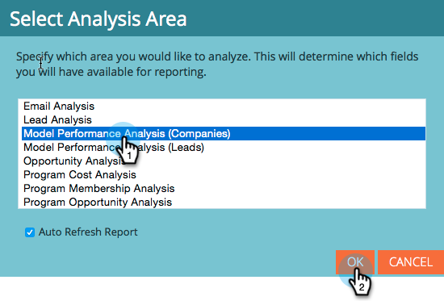
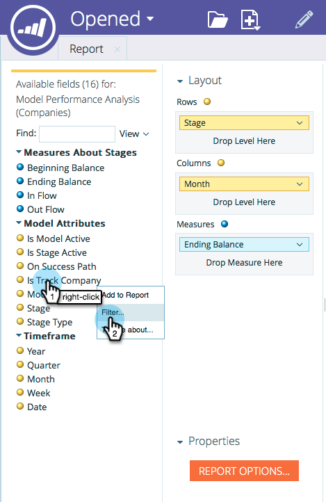

# Starta spårning efter konto i intäktsmodelleraren {#start-tracking-by-account-in-the-revenue-modeler}

Med intäktsmodelleraren och intäktsutforskaren får du insikt i hur era leads och konton fungerar när de går igenom er modell.

>[!NOTE]
>
>Kontrollera att den godkända modellen har faser på framgångsbanan med alternativet **Starta spårning efter konto** markerat

1. När det har gått tillräckligt lång tid för att samla in användbara data väljer du **Intresseutforskaren** under **My Marketo Home**.

   

1. Om du vill skapa en ny rapport klickar du på **Arkiv** och väljer **Nytt** och sedan **Rapport**.

   

1. Välj **Model Performance Analysis (företag)** som analysområde och klicka på **OK**.

   

1. Vi rekommenderar att du drar i fälten **Stage**, **Month** och **Ending Balance** för att visa hur företag utvecklas i din modell efter månad. Använd filter för att välja de månader du vill ha.

   

1. När du är klar med konfigurationen av rapporten högerklickar du på **Is Track Company** och väljer **Filter**. Vi använder den här för att begränsa rapporten till endast stadier där **Spärra per konto** har valts.

   

1. I den dialogruta som visas väljer du Ja och klickar på högerpilen i mitten. Detta filtrerar endast de steg där Spärra efter konto är aktiverat. Klicka på **OK** när du är klar.

   

1. Din rapport bör nu endast visa de stadier som du spårar efter konto. Spara rapporten så att du kan använda den i framtiden. Nu kan ni använda detta som ett annat mått på hur framgångsrik er marknadsföring är.

