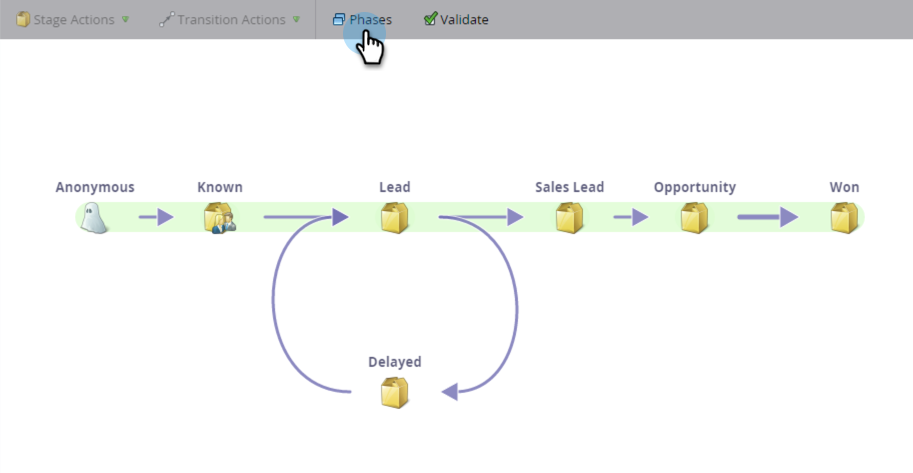

# Förstå intäktsmodellfaser {#understanding-revenue-model-phases}

Med faser kan du gruppera ett antal steg. Ibland återspeglar flera steg i en modell en fas i en funnel.

## Definiera modellens faser {#define-the-phases-of-the-model}

1. Klicka på **[!UICONTROL Phases]**.

   

1. Klicka på den blå knappen för att dra faserna uppåt och nedåt genom scenerna.

   
