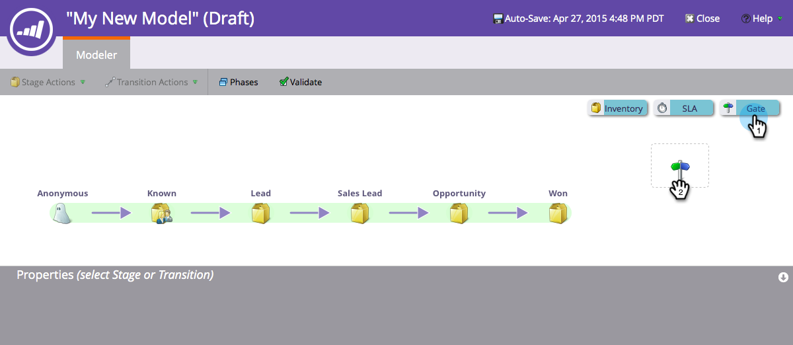
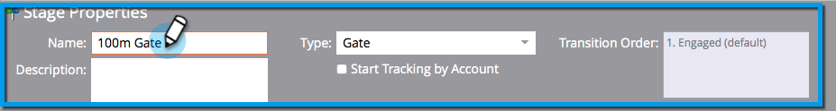

# Använda intäktsmodellens gatustadier {#using-revenue-model-gate-stages}

En gate-fas fungerar som en kvalifikationskontroll.

>[!TIP]
>
>Det är en bra idé att skapa en övningsmodell i ett grafik- eller presentationsprogram och bekräfta den med dina kollegor.

## Lägga till en Gate-scen {#add-a-gate-stage}

1. Gå till **Analytics** .

   

1. Välj en befintlig modell eller [skapa en ny](create-a-new-revenue-model.md).

   

1. Klicka på **Redigera** **utkast**.

   

1. Klicka på knappen **Gate** och dra och släpp var som helst på arbetsytan.

   

1. Redigera **Name **och välj en **typ**.

   >[!NOTE]
   >
   >Välj [Starta spårning efter konto](start-tracking-by-account-in-the-revenue-modeler.md) nu för att få insikt i hur dina konton fungerar när de utvecklas i din modell.

   

>[!NOTE]
>
>Gate Stage delar upp leads baserat på kriterier som du anger i övergångsreglerna. **den inte håller leads**. En standardövergång krävs så att leads som inte väljs av de andra övergångarna hamnar i standardläget.

## Redigera en Gate-scen {#edit-a-gate-stage}

Redigera namnet, beskrivningen och justera typen av Gate-scenen. Du kan också välja [Starta spårning efter konto](start-tracking-by-account-in-the-revenue-modeler.md).

1. Klicka på en **Gate** stage-ikon.

   

1. Klicka i fälten **Namn** och **Beskrivning** för att redigera innehållet.

   

1. Markera listrutan **Typ** som du vill redigera.

   

## Ta bort en Gate-scen {#delete-a-gate-stage}

1. Du kan ta bort en Gate-scen genom att högerklicka på Gate-scenikonen och välja **Ta bort**.

   

1. Du kan också ta bort en Gate-scen genom att klicka på den och sedan välja **Ta bort** i listrutan **Scenåtgärder**.

   

1. Båda borttagningsmetoderna ber dig bekräfta ditt val. Klicka på **Ta bort**.

   

Grattis! Nu förstår du Gate Stages underbara värld.

>[!NOTE]
>
>**Relaterade artiklar**
>
>* [Använda intäktsmodelllagerfaser](using-revenue-model-inventory-stages.md)
>* [Använda SLA-faser för intäktsmodell](using-revenue-model-sla-stages.md)
>* [Skapa en ny intäktsmodell](create-a-new-revenue-model.md).

>

