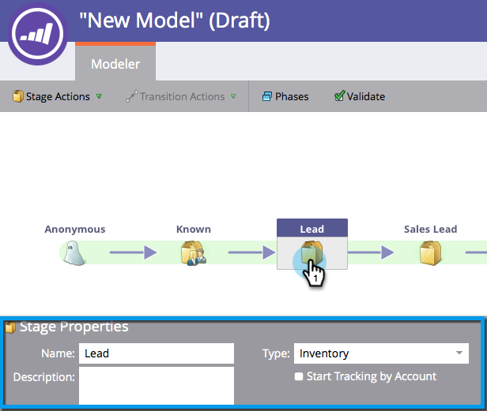

# Använda intäktsmodelllagerartiklar {#using-revenue-model-inventory-stages}

Alla kända leads och konton finns från början i lagerstadiet. Den här potentiella kundpoolen är den plats där leads vårdas tills säljprojektet är klart. Det finns ingen tidsgräns för en lagerfas.

>[!TIP]
>
>Det är en bra idé att skapa en övningsmodell i ett grafik- eller presentationsprogram och bekräfta den med dina kollegor först.

## Lägg till en lagerfas {#add-an-inventory-stage}

1. Om du vill lägga till ett nytt stadium för intäktscykelmodellinventering klickar du på knappen **Analytics** i startskärmen för **My Marketo**.

   

1. Välj en befintlig modell i **Analytics** eller [skapa en ny](create-a-new-revenue-model.md).

   

1. Klicka på **Redigera utkast**.

   

1. Om du vill lägga till en ny lagerfas klickar du på knappen **Lager** och drar och släpper sedan till valfri plats på arbetsytan.

   

1. Du kan redigera namnet, lägga till en beskrivning och justera texten när du har lagt till en scen. Du kan även välja ** [Starta spårning efter konto](start-tracking-by-account-in-the-revenue-modeler.md)** just nu.

   

## Redigera en lagerfas {#edit-an-inventory-stage}

När du väljer en inventeringsikon kan du redigera **namnet**, lägga till en **Beskrivning** eller justera **Typ**. Du kan också välja [Starta spårning efter konto](start-tracking-by-account-in-the-revenue-modeler.md).

1. Klicka på en inventeringsikon.

   

1. Klicka i fälten **Namn** och **Beskrivning** för att redigera innehållet.

   

1. Välj den **typmeny** som du vill redigera.

   

## Ta bort en lagerfas {#delete-an-inventory-stage}

1. Du kan ta bort en inventeringsfas genom att högerklicka eller Ctrl-klicka på en inventeringsscenikon.

   

1. Du kan också ta bort en scen genom att klicka på den och sedan välja **Ta bort** scenåtgärder **i listrutan &lt;a2/>Ta bort**.

   

1. Båda borttagningsmetoderna ber dig bekräfta ditt val. Klicka på **Ta bort**.

   

Grattis! Nu förstår du den underbara världen med Inventory Stages.
