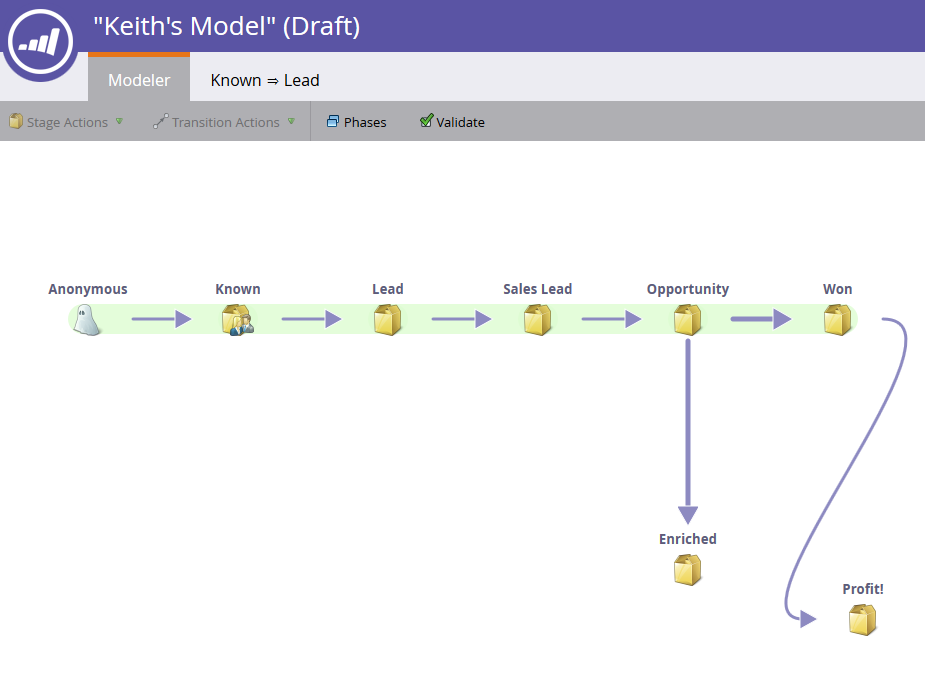

# Använda intäktsmodellövergångar {#using-revenue-model-transitions}

>[!PREREQUISITES]
>
>[Skapa en ny intäktsmodell](create-a-new-revenue-model.md)

När du skapar modellen och väljer och organiserar dina lagerfaser är det dags att ange övergångarna.

1. Högerklicka (du kan också dubbelklicka) på en av pilarna för att komma igång och välj **Redigera övergång**.

   

   >[!NOTE]
   >
   >Övergångsreglerna för övergången till&quot;anonyma Ð&quot; kan inte ändras.

1. En ny flik öppnas för den övergång du har valt.   
1. Övergångar styr hur leads rör sig mellan faser. Dra utlösaren (eller filtret) från höger och släpp den var som helst på arbetsytan. I det här exemplet väljer vi utlösaren för Fyll i formulär.

   >[!TIP]
   >
   >Eftersom intäktsmodelleraren konfigurerar dig för rapportering bör övergångarna alltid innehålla utlösare. På så sätt återspeglar dina rapporter hur snabbt modellen/scenflödet är. Filter kan läggas till med utlösarna för ytterligare begränsningar.

   

1. Välj parameter/parametrar för vald utlösare/filter.

   

1. Klicka på **Modeler** om du vill gå tillbaka till modellen.

   

1. Längst ned på skärmen visas nu övergångsreglerna.

   

1. När du har konfigurerat regler för alla övergångar klickar du på **Verifiera** för att verifiera.

   

1. Om det görs på rätt sätt visas följande meddelande.

   

Bra gjort! Du har ändrat modellövergångarna.

>[!NOTE]
>
>**Relaterade artiklar**
>
>[Godkänn/avgodkänn en intäktsmodell](approve-unapprove-a-revenue-model.md)
