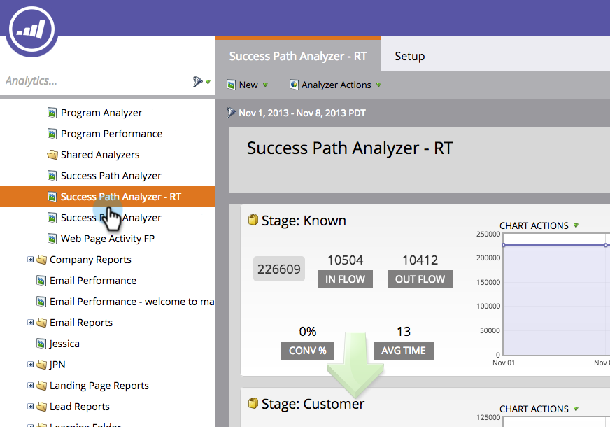

# Använda sökvägsanalysen {#using-the-success-path-analyzer}

Använd en Success Path Analyzer för att utforska de specifika detaljer som återspeglar både flöde (mängd) och hastighet (hastighet, i antal dagar) för personer genom faserna i [intäktscykelmodellen](/help/marketo/product-docs/reporting/revenue-cycle-analytics/revenue-cycle-models/understanding-revenue-models.md).

>[!PREREQUISITES]
>
>[Skapa en lyckad sökvägsanalys](/help/marketo/product-docs/reporting/revenue-cycle-analytics/revenue-cycle-models/create-a-success-path-analyzer.md)

1. Gå till **[!UICONTROL Analytics]** och välj din **Success Path Analyzer**.

   

   Diagrammet till höger visar data i den markerade knappen till vänster. Som standard är detta **[!UICONTROL Balance]**.

1. Klicka på **[!UICONTROL In Flow]** om du vill visa ett diagram över hur många personer som kom in på scenen under den markerade tidsramen.

   

   * Klicka på **[!UICONTROL Out Flow]** om du vill visa ett diagram över hur många personer som har lämnat scenen.
   * Klicka på **[!UICONTROL Conv %]** om du vill diagram över konverteringsgraden från det här till nästa steg.
   * Klicka på **[!UICONTROL Avg Time]** om du vill se hur länge personer har tillbringat i den här fasen innan du flyttar till nästa fas.

1. Klicka på **[!UICONTROL Chart Actions]** > **[!UICONTROL Compare Period]** för att jämföra data med en annan tidsram med samma längd.

   

1. Välj datumet **[!UICONTROL From]** för jämförelseperioden.

   

   Datumet **[!UICONTROL To]** anges automatiskt så att det matchar längden på den ursprungliga tidsperioden.

1. Klicka på **[!UICONTROL Compare]**.

   

1. Diagrammet uppdateras med överlappande data för jämförelseperioden, i grönt.

   

1. Om du vill ändra tidsskalan för diagrammet klickar du på någon av **[!UICONTROL Graph by]**-knapparna: daglig (standard), veckovis och månadsvis

   

1. För steg med servicenivåavtal (SLA) klickar du på **[!UICONTROL Chart Actions]** > **[!UICONTROL Show SLA Due]** för att visa alla personer som någon gång missat ett SLA-mål inom den angivna tidsramen.

   

1. Diagrammet uppdateras för att visa hur många SLA som förföll till betalning på varje nod, i orange.

   

   Personerna som visas med orange kan vara *eller kanske inte* fortfarande vara i SLA-scenen.

1. Klicka på **[!UICONTROL Chart Actions]** > **[!UICONTROL Show SLA Past Due]** för att visa alla personer med utgångna SLA-mål som fortfarande befinner sig i SLA-stadiet vid slutet av den angivna tidsperioden.

   

1. Diagrammet uppdateras för att visa hur många SLA som förföll på varje nod, i orange.

   

1. Håll markören över bubblan om du vill läsa den specifika informationen för en datapunkt på en viss nod (datum).

   

1. Om du vill skriva ut diagrammet klickar du på **[!UICONTROL Chart Actions]** > **[!UICONTROL Print Chart]**.

   

Analysatorn är här för att hjälpa dig att förstå hur modellen rör sig. I takt med att ni blir mer avancerade blir detta mycket viktigt för att strategiska era era marknadsföringssatsningar.
