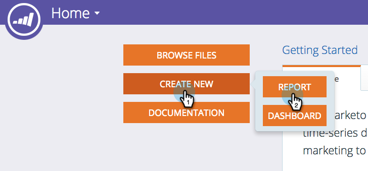

# Skapa en rapport för intäktsutforskaren {#create-a-revenue-explorer-report}

Med rapporten Revenue Explorer (intäktsutforskaren) kan du följa avkastningen på era marknadsföringssatsningar.

>[!NOTE]
>
>**Tillgänglighet**
>
>Alla kunder har inte köpt den här funktionen. Kontakta din säljare för mer information.

1. Gå till området **Intresseutforskaren **.

   

1. Klicka på **Skapa ny** och välj sedan **Rapport**.

   

1. Välj en rapporttyp.

   

   Bra! Du har officiellt skapat en rapport. Dags att anpassa genom att lägga till några fält!

   

>[!NOTE]
>
>**Relaterade artiklar**
>
>* [Lägga till fält i en Intresseutforskarrapport](adding-fields-to-a-revenue-explorer-report.md)
>* [Lägga till anpassade mått i en Intresseutforskarrapport](adding-custom-measures-to-a-revenue-explorer-report.md)

>

