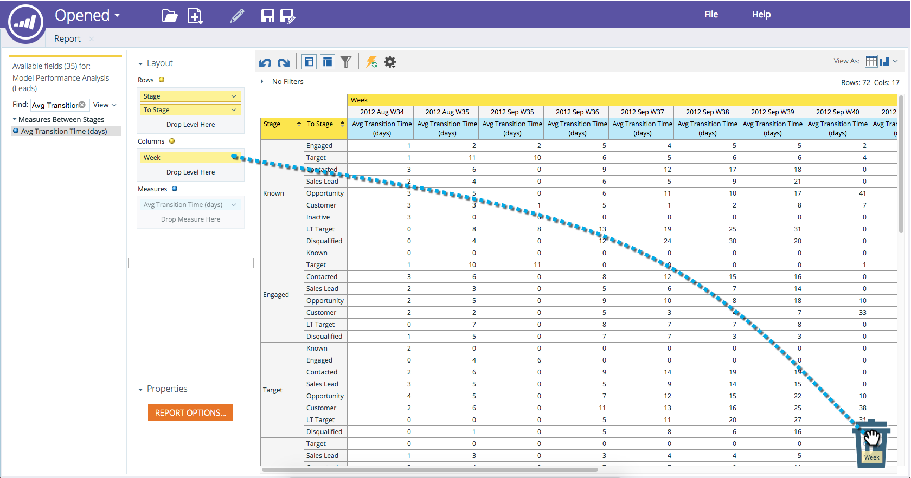

# Ta bort ett fält i en [!UICONTROL Revenue Explorer]-rapport {#deleting-a-field-in-a-revenue-explorer-report}

Ibland kan du dra fel fält till rapporten. Så här tar du bort den:

1. Dra fältet som du vill ta bort till ikonen **papperskorgen** längst ned till höger i rapporten.

   

   >[!NOTE]
   >
   >Papperskorgen är dold tills du börjar dra ett fält.

>[!MORELIKETHIS]
>
>[Sparar en [!UICONTROL Revenue Explorer] rapport](/help/marketo/product-docs/reporting/revenue-cycle-analytics/revenue-explorer/saving-a-revenue-explorer-report.md)
