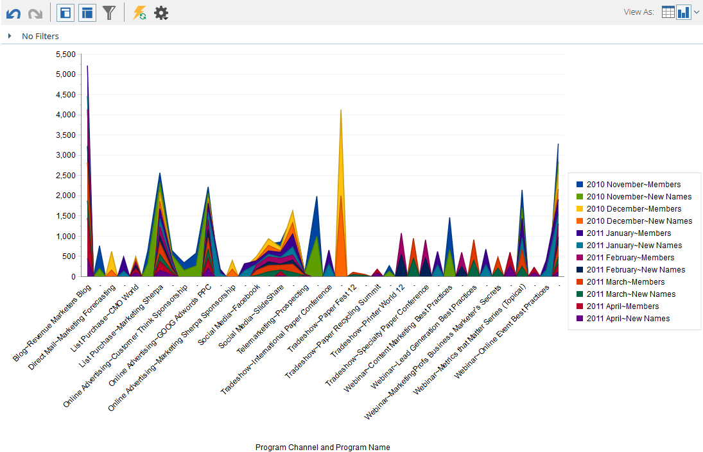

# Diagramresultat från [!UICONTROL Revenue Explorer] {#graphing-results-from-revenue-explorer}

Som standard visas rapporter i [!UICONTROL Revenue Explorer] som en tabell. Du kan också visa resultat som diagram i olika format.

1. Klicka på pilen i listrutan **[!UICONTROL View As]** i rapporten. Olika övertoningsalternativ visas.

   

## Diagramexempel {#graph-examples}

**[!UICONTROL Column]**: Varje rad och kolumn i tabellen visas som en lodrät kolumn.

**[!UICONTROL Stacked Column]**: Varje rad i tabellen har en kolumn i diagrammet.

**[!UICONTROL 100% Stacked Column]**: Varje rad i tabellen har en kolumn i diagrammet och skalas till 100 %.

**[!UICONTROL Line]**: Varje kolumn visas som en rad och varje rad som en datapunkt på raden.

**[!UICONTROL Column-Line Combo]**: En kombination av [!UICONTROL Column] och [!UICONTROL Line] diagram.

**[!UICONTROL Bar]**: Varje rad och kolumn i tabellen visas som ett vågrätt fält.

**[!UICONTROL Stacked Bar]**: Varje rad i tabellen har en rad i diagrammet.

**[!UICONTROL 100% Stacked Bar]**: Varje rad i tabellen har en rad i diagrammet och skalas till 100 %.

**[!UICONTROL Area]**: Data visas på ungefär samma sätt som staplade fält, men är ifyllda.

**[!UICONTROL Pie]**: Varje kolumn visas som ett cirkeldiagram, varje rad visas som ett segment.

**[!UICONTROL Sunburst]**: Radiellt diagram som representerar attribut i segment.

**[!UICONTROL Scatter]**: Bubblor baserade på använda attribut. Använd mått för att färgkoda bubblan och/eller bestämma dess storlek.

**[!UICONTROL Heat Grid]**: Anpassa färger och former för att identifiera positiva och negativa prestandamönster.

1. Klicka på tabellknappen om du vill växla tillbaka till tabellvyn.

   
