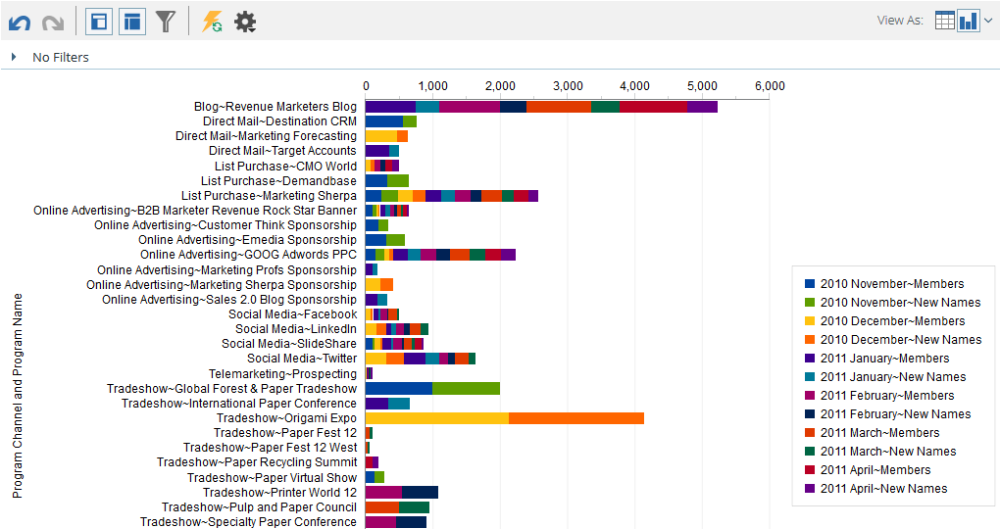

# Diagramresultat från intäktsutforskaren {#graphing-results-from-revenue-explorer}

Som standard visas rapporter i skatteutforskaren som en tabell. Du kan också visa resultat som diagram i olika format.

1. Klicka på pilen i listrutan **Visa som** i rapporten. Olika övertoningsalternativ visas.

   

## Diagramexempel {#graph-examples}

**Kolumn**: Varje rad och kolumn i tabellen visas som en lodrät kolumn.

**Staplad stapel**: Varje rad i tabellen har en kolumn i diagrammet.

**Staplad fraktionsstapel**: Varje rad i tabellen har en kolumn i diagrammet och skalas till 100 %.

**Rad**: Varje kolumn visas som en rad och varje rad som en datapunkt på raden.

**Kombinationsruta** för spaltlinjer: Kombination av stapeldiagram och linjediagram.

**Stapel**: Varje rad och kolumn i tabellen visas som ett vågrätt fält.

**Staplad liggande**: Varje rad i tabellen har en rad i diagrammet.

**Staplad liggande fraktionsstapel**: Varje rad i tabellen har en rad i diagrammet och skalas till 100 %.

**Område**: Data visas som staplade fält, men är ifyllda.

**Cirkel**: Varje kolumn visas som ett cirkeldiagram, varje rad visas som ett segment.

**Sunburst**: Radiellt diagram som representerar attribut i segment.

**Spridning**: Bubblor baserade på använda attribut. Använd mått för att färgkoda bubblan och/eller för att bestämma dess storlek.

**Värmestödraster**: Anpassa färger och former för att identifiera positiva och negativa prestandamönster.

1. Klicka på tabellknappen om du vill växla tillbaka till tabellvyn.

   

