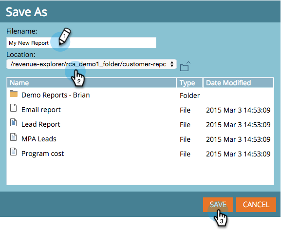

# Sparar en [!UICONTROL Revenue Explorer]-rapport {#saving-a-revenue-explorer-report}

[!UICONTROL Revenue Explorer] rapporter kan sparas i den fil du väljer.

1. Klicka på ikonen Spara.

   

   >[!NOTE]
   >
   >Ändringar som du gör i rapporten sparas inte automatiskt. Spara då ofta!

1. Ge rapporten ett beskrivande namn, välj en plats och klicka på **[!UICONTROL Save]**!

   

   Det är allt! Du kan nu komma åt filen i **[!UICONTROL Browse Files]**.

   

>[!MORELIKETHIS]
>
>[Prenumerera på en [!UICONTROL Revenue Explorer] rapport](/help/marketo/product-docs/reporting/revenue-cycle-analytics/revenue-explorer/subscribe-to-a-revenue-explorer-report.md)
