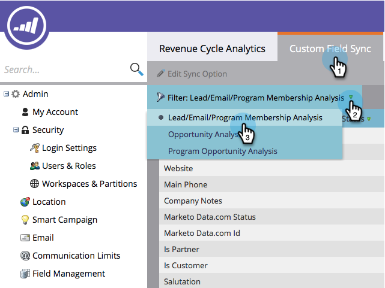

# Synkronisera anpassade fält med intäktsutforskaren {#sync-custom-fields-to-the-revenue-explorer}

Intäktscykelanalys kan rapportera i anpassade Marketo-fält. För att kunna göra det måste du ange att anpassade fält ska synkroniseras.

>[!NOTE]
>
>**Administratörsbehörigheter krävs**

1. Gå till **Administratör** -avsnitt.

   

1. Välj **Analys av intäktscykler**.

   

1. Klicka på **Synkronisering av anpassat fält** och välj det analysområde du vill använda.

   

1. Markera fältet som du vill aktivera synkronisering för och klicka på **Redigera synkroniseringsalternativ**.

   

1. Ändra **Synkroniseringsstatus** till **Aktiverad**.

   

1. Välj **RCA-typ** klickar du **Spara**.

   

   >[!TIP]
   >
   >När det här alternativet är aktiverat kommer uppgifterna att vara tillgängliga i intäktscykelanalys följande dag.

   Snyggt jobb! Nu vet du hur du lägger till anpassade fält i RCA.
