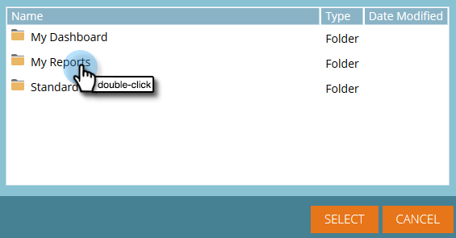

# Använda instrumentpaneler i Intresseutforskaren {#using-dashboards-in-revenue-explorer}

En kontrollpanel är en kombination av rapporter från Intresseutforskaren för att få en snabb översikt över era leads, kampanjer, möjligheter och/eller modeller.

## Skapa en ny instrumentpanel {#creating-a-new-dashboard}

1. Klicka **Intäktsutforskaren**.

   

1. Klicka **Skapa nytt** sedan **Kontrollpanel**.

   

1. Mallar är som standard markerade längst ned på sidan. Klicka på den layout som du vill använda. &quot;2 Column&quot; används här.

   

   >[!NOTE]
   >
   >Du kan anpassa kontrollpanelens utseende ytterligare genom att klicka på **Teman** och välja din favorit.

1. Klicka på **Infoga** ikon och markera **Fil**.

   

1. Dubbelklicka **Intäktsutforskaren**.

   

1. Dubbelklicka **Alla rapporter och kontrollpaneler**.

   

1. Dubbelklicka på mappen där den rapport som du vill använda finns.

   

1. Välj rapporten och klicka på **Välj**.

   

1. Rapporten fylls sedan i. Upprepa steg 4-8 för varje återstående avsnitt.

   

1. Om du vill byta namn på ett avsnitt markerar du det genom att klicka på det, skriver det önskade namnet under Titel och klickar på **Använd**. Upprepa för varje avsnitt.

   

1. Om du vill spara klickar du på ikonen Spara, anger ett filnamn, dubbelklickar på mappen Intresseutforskaren tills du kommer till önskad mapp för instrumentpanelen och klickar på **Spara**.

   

## Redigera en kontrollpanel {#editing-a-dashboard}

1. Klicka **Intäktsutforskaren**.

   

1. Dubbelklicka på **Intäktsutforskaren** mapp. Navigera till den plats där kontrollpanelen finns.

   

1. Markera den kontrollpanel som du vill redigera och klicka sedan på **Redigera**.

   

## Ta bort en instrumentpanel {#deleting-a-dashboard}

1. Klicka **Intäktsutforskaren**.

   

1. Dubbelklicka på **Intäktsutforskaren** mapp. Navigera till den plats där kontrollpanelen finns.

   

1. Markera den instrumentpanel som du vill ta bort och klicka sedan på **Flytta till papperskorgen**.

   
