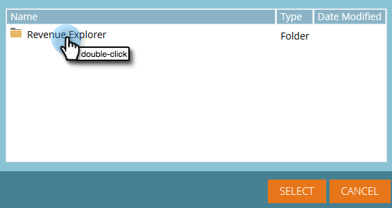

# Använda instrumentpaneler i [!UICONTROL Revenue Explorer] {#using-dashboards-in-revenue-explorer}

En instrumentpanel är en kombination av [!UICONTROL Revenue Explorer] rapporter för att få en snabb översikt över dina leads, kampanjer, möjligheter och/eller modeller.

## Skapa en ny instrumentpanel {#creating-a-new-dashboard}

1. Klicka på **[!UICONTROL Revenue Explorer]**.

   

1. Klicka på **[!UICONTROL Create New]** och sedan på **[!UICONTROL Dashboard]**.

   

1. Mallar är som standard markerade längst ned på sidan. Klicka på den layout som du vill använda. &quot;2 Column&quot; används här.

   

   >[!NOTE]
   >
   >Du kan anpassa instrumentpanelens utseende ytterligare genom att klicka på **[!UICONTROL Themes]** och välja din favorit.

1. Klicka på ikonen **Infoga** och välj **[!UICONTROL File]** i den första delen av kontrollpanelen.

   

1. Dubbelklicka på **[!UICONTROL Revenue Explorer]**.

   

1. Dubbelklicka på **[!UICONTROL All Reports and Dashboards]**.

   

1. Dubbelklicka på mappen där den rapport som du vill använda finns.

   

1. Välj rapporten och klicka på **[!UICONTROL Select]**.

   

1. Rapporten fylls sedan i. Upprepa steg 4-8 för varje återstående avsnitt.

   

1. Om du vill byta namn på ett avsnitt klickar du på det för att markera det, skriver det önskade namnet under **[!UICONTROL Title]** och klickar på **[!UICONTROL Apply]**. Upprepa för varje avsnitt.

   

1. Om du vill spara klickar du på ikonen [!UICONTROL Save], anger en [!UICONTROL Filename], dubbelklickar på mappen [!UICONTROL Revenue Explorer] tills du kommer till önskad mapp för instrumentpanelen och klickar på **[!UICONTROL Save]**.

   

## Redigera en kontrollpanel {#editing-a-dashboard}

1. Klicka på **[!UICONTROL Revenue Explorer]**.

   

1. Dubbelklicka på mappen **[!UICONTROL Revenue Explorer]**. Navigera till den plats där kontrollpanelen finns.

   

1. Markera den instrumentpanel som du vill redigera och klicka sedan på **[!UICONTROL Edit]**.

   

## Ta bort en instrumentpanel {#deleting-a-dashboard}

1. Klicka på **[!UICONTROL Revenue Explorer]**.

   

1. Dubbelklicka på mappen **[!UICONTROL Revenue Explorer]**. Navigera till den plats där kontrollpanelen finns.

   

1. Markera den instrumentpanel som du vill ta bort och klicka sedan på **[!UICONTROL Move to Trash]**.

   
