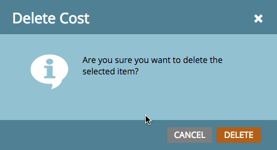

# Definiera periodkostnader {#define-period-costs}

>[!NOTE]
>
>**Definition**
>
>En periodkostnad är det belopp du spenderar på ett program. Den kan vara i en eller flera månader och används för att rapportera ROI.

Spåra och associera kostnader för ledande moderering och inköp av leads för ett program eller ett evenemang genom att definiera när och var ni vill ta kostnader för leads.

>[!NOTE]
>
>Ange prognostiserade kostnader i början av programmet. När perioden i programmet har slutförts kan du redigera [!UICONTROL Period Cost] och ange den faktiska kostnaden. Detta ger korrekta rapportresultat.

## Definiera en [!UICONTROL Period Cost] {#define-a-period-cost}

1. Gå till fliken **[!UICONTROL Setup]** i ditt program eller din händelse.

   

1. Dra och släpp **[!UICONTROL Period Cost]** på arbetsytan så visas dialogrutan **[!UICONTROL New Cost]**.

   

1. Ange **[!UICONTROL Program Month]** som du vill associera med den definierade kostnaden.

   

1. Ange ett **[!UICONTROL Period Cost]** som heltal utan decimaler eller kommatecken (maxgräns: 9999999)

   

   >[!NOTE]
   >
   >Valutan (t.ex. USD, EUR osv.) är en global inställning som hanteras av en Marketo-administratör

1. Ange en beskrivande **[!UICONTROL Note]** (valfritt) och klicka på **[!UICONTROL Save]**.

   

## Redigera en [!UICONTROL Period Cost] {#edit-a-period-cost}

1. Högerklicka på [!UICONTROL Period Cost] och välj **[!UICONTROL Edit]** på snabbmenyn för att öppna dialogrutan **[!UICONTROL Edit Cost]**.

   

1. Redigera periodkostnaden efter behov

   

## Ta bort en [!UICONTROL Period Cost] {#delete-a-period-cost}

1. Högerklicka på den [!UICONTROL Period Cost] som du vill ta bort och välj **[!UICONTROL Delete]** på snabbmenyn för att visa **[!UICONTROL Delete Cost]**-prompten.

   

1. Klicka på **[!UICONTROL Delete]** om du vill ta bort periodkostnaden permanent eller **[!UICONTROL Cancel]** om du vill gå tillbaka.

   
