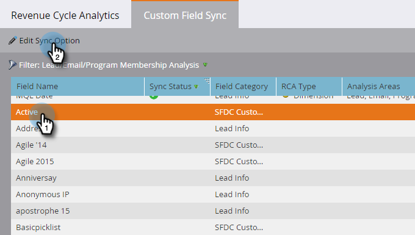

# Aktivera anpassad fältsynkronisering för analys av intäktscykler {#enabling-custom-field-sync-for-revenue-cycle-analytics}

Med följande steg kan du använda anpassade fält i RCA-rapporter.

1. Klicka på **Admin**.

   

1. Klicka på **Inkomstcykelanalys** och sedan **Anpassad fältsynkronisering**.

   

1. Markera **fältnamnet** och klicka sedan på **Redigera synkroniseringsalternativ**.

   

1. Under Synkroniseringsstatus väljer du **Aktiverad** och klickar sedan på **Spara**.

   

1. Den gröna kontrollen talar om för dig att fältet är inställt för synkronisering.

   

   Och det där!

   >[!NOTE]
   >
   >När fältet är aktiverat är informationen tillgänglig i Inkomstcykelanalys nästa dag.

