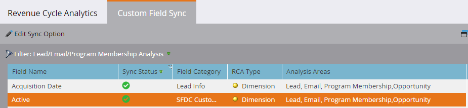

# Aktiverar synkronisering av anpassade fält för [!UICONTROL Revenue Cycle Analytics] {#enabling-custom-field-sync-for-revenue-cycle-analytics}

Med följande steg kan du använda anpassade fält i RCA-rapporter.

1. Klicka på **[!UICONTROL Admin]**.

   

1. Klicka på **[!UICONTROL Revenue Cycle Analytics]** och sedan på **[!UICONTROL Custom Field Sync]**.

   

1. Välj din **[!UICONTROL Field Name]** och klicka sedan på **[!UICONTROL Edit Sync Option]**.

   

1. Under **[!UICONTROL Sync Status]** väljer du **[!UICONTROL Enabled]** och klickar sedan på **[!UICONTROL Save]**.

   

1. Den gröna kontrollen talar om för dig att fältet är inställt för synkronisering.

   

   Och det där!

   >[!NOTE]
   >
   >När fältet har aktiverats är data tillgängliga i [!UICONTROL Revenue Cycle Analytics] nästa dag.
