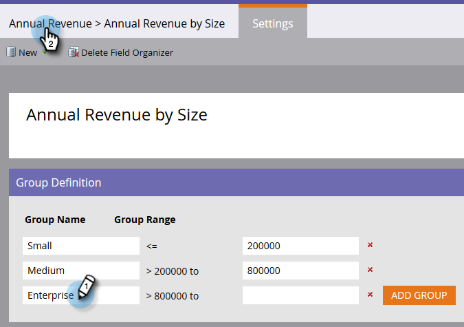
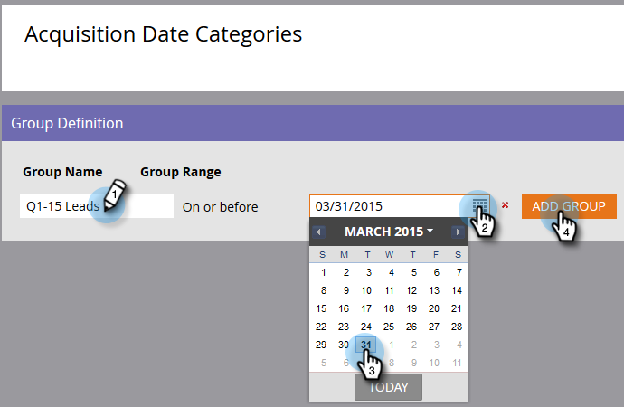

# Skapa anpassade fältgrupper med fältorganiseraren {#create-custom-field-groups-using-the-field-organizer}

Innan du kan aktivera anpassade fältgrupper för rapportering i området för modellresultatanalys (Leads) i intäktscykelutforskaren måste du kategorisera standardfält eller anpassade fält i grupper för rapportering via Fältorganiseraren i Marketo Lead Management. Detta gäller endast lead- och företagsattribut.
När du väljer ett standardfält eller ett anpassat fält i listrutan Fält i dialogrutan Sorteraren i nytt fält mappas den Marketo Lead Management-datatyp som är associerad med det fält som du vill gruppera med en av tre tillgängliga redigerare i fältSorteraren: sträng, heltal eller datum.

| Marketo Lead Management-datatyp | Datatyp för redigeraren i fältorganiseraren |
|---|---|
| Sträng | Sträng |
| E-post | Sträng |
| Heltal | Heltal |
| Text | Sträng |
| URL | Sträng |
| Referens | Stöds inte |
| Valuta | Heltal |
| DateTime | Datum |
| Boolean | Stöds inte |
| Tel. | Sträng |
| Datum | Datum |
| Float | Heltal |
| Beräknat | Stöds inte |

I följande tre avsnitt beskrivs hur du skapar en anpassad fältgrupp för en sträng, ett heltal eller en datumtyp.

## Skapa anpassad fältgrupp - Strängredigeraren {#create-custom-field-group-string-editor}

1. Klicka **Lead-databas**.

   

1. Klicka **Nytt** och markera **Ny fältorganisatör**.

   

1. Klicka **Fält** och markera ett standardfält eller ett anpassat fält med en datatyp som mappar till strängredigeraren (se tabellen i föregående avsnitt). Land används här.

   

1. Klicka **Skapa**.

   

   Den nya anpassade gruppen visas i trädet Lead Database som representeras av Field Name > Field Name Group (fältnamnsgrupp) (exempel: Land > Landgrupp).

   

1. Klicka på pennikonen för att anpassa namnet. Du kan till exempel ändra namnet&quot;Landgrupp&quot; till&quot;Kontinent&quot;. Skriv det nya namnet och klicka utanför rutan för att spara automatiskt.

   

1. Som standard placeras alla datavärden i undergruppen&quot;Annat&quot;. Om du vill kategorisera datavärdena klickar du på **Lägg till grupp** om du vill skapa en undergrupp och ge den ett namn.

   >[!NOTE]
   >
   >Du kan lägga till upp till tio undergrupper för att kategorisera datavärdena. Varje undergrupp som skapas tilldelas ett ID-nummer.

   I det här exemplet har grupper skapats för de flesta kontinenter.

   

   >[!NOTE]
   >
   >Om du vill ta bort en undergrupp klickar du bara på det röda X:et bredvid undergruppens namn. Om det finns datavärden i gruppen flyttas datavärdena till standardgruppen Andra.

1. Markera ett eller flera datavärden på arbetsytan och dra och släpp datavärdena i lämplig undergrupp.

   

   >[!NOTE]
   >
   >Om du vill ta bort ett datavärde från en undergrupp tilldelar du om datavärdet till standardgruppen Annan.

1. Använd filteralternativet i det övre vänstra hörnet direkt ovanför arbetsytan för att markera och visa datavärdena i en eller flera undergrupper. Datavärdena som baseras på filtermarkeringen visas på arbetsytan.

   

   >[!NOTE]
   >
   >När grupperna har definierats kan du aktivera den anpassade fältgruppen för rapportering i Model Performance Analysis (Leads) via fliken Revenue Cycle Analytics i Marketo Lead Management.

## Skapa anpassad fältgrupp - heltalsredigerare {#create-custom-field-group-integer-editor}

1. Klicka **Lead-databas**.

   

1. Klicka **Nytt** och markera **Ny fältorganisatör**.

   

1. Klicka **Fält** och markera ett standardfält eller ett anpassat fält med en datatyp som mappar till strängredigeraren (se tabellen i föregående avsnitt). Årsintäkt används här.

   

1. Klicka **Skapa**.

   

   Den nya anpassade gruppen visas i trädet Lead Database som representeras av Field Name > Field Name Group (fältnamnsgrupp) (exempel: Årlig intäkt > Årlig intäktsgrupp).

   

1. Klicka på det anpassade gruppnamnet som är standard ovanför heltalsredigeraren för att anpassa namnet. Du kan till exempel byta namn på Årlig intäktsgrupp till Årlig intäkt efter storlek. Klicka **Spara**.

   

   Med heltalsredigeraren kan du skapa flera undergrupper som definierar varje undergrupp efter storlek. I det här exemplet kommer tre grupper att skapas för små, medelstora och företag.

1. Om du vill lägga till din första grupp anger du ett namn i **Gruppnamn** fält (exempel: Liten) och ange ett maxvärde i **Gruppintervall** fält (exempel: 200000). Klicka **Lägg till grupp**.

   

   En tom grupppost visas under den grupp som du just angav. I exemplet nedan visas en post för små, medelstora och företag.

   >[!NOTE]
   >
   >Du kan lägga till upp till tio undergrupper för att kategorisera datavärdena. Varje gruppintervallpost bygger på föregående post. Om du lämnar den sista gruppintervallposten tom för den sista anpassade undergruppen som du skapar, kommer inget maximalt datavärde att anges.

1. Klicka på fliken Sammanfattning för att spara och granska inställningarna.

   

   >[!NOTE]
   >
   >Om du vill ta bort en undergrupp klickar du på det röda X:et bredvid undergruppens namn.

1. Granska inställningarna på sidan Sammanfattning.

   

   >[!NOTE]
   >
   >När grupperna har definierats kan du aktivera den anpassade fältgruppen för rapportering i Model Performance Analysis (Leads) via fliken Revenue Cycle Analytics i Marketo Lead Management.

## Skapa anpassad fältgrupp - datumredigerare {#create-custom-field-group-date-editor}

1. Klicka **Lead-databas**.

   

1. Klicka **Nytt** och markera **Ny fältorganisatör**.

   

1. Klicka **Fält** och markera ett standardfält eller ett anpassat fält med en datatyp som mappar till strängredigeraren (se tabellen i föregående avsnitt). Anskaffningsdatum används här.

   

1. Klicka **Skapa**.

   

   Den nya anpassade gruppen visas i trädet Lead Database som representeras av Field Name > Field Name Group (fältnamnsgrupp) (exempel: Anskaffningsdatum > Inköpsdatumgrupp).

   

1. Klicka på det anpassade gruppnamnet som är standard ovanför datumredigeraren för att anpassa namnet. Du kan till exempel ändra namnet&quot;Inköpsdatumgrupp&quot; till&quot;Inköpsdatumkategorier&quot;. Klicka **Spara**.

   

   Med datumredigeraren kan du skapa flera undergrupper och definiera varje undergrupp efter datum. I det här exemplet skapas tre grupper: Kv1-15 leads, kv2-15 leads och kv3-15 leads.

1. Om du vill lägga till din första grupp anger du ett namn i **Gruppnamn** fält (exempel: Q1-15 Leads) och ange ett datum i datumfältet som representerar det datum då leadet förvärvades den eller tidigare (exempel: 3/31/2015 för sista dagen i Q1-15). Klicka **Lägg till grupp**.

   

   >[!NOTE]
   >
   >Du kan lägga till upp till tio undergrupper för att kategorisera datavärdena. Varje gruppintervallpost bygger på föregående post. Om du lämnar den sista gruppintervallposten tom för den sista anpassade undergruppen som du skapar, kommer inget slutdatumvärde att anges.

   I exemplet nedan visas en post för Q1 2015 som leder genom Q3.

   

   Och det är allt! Bra jobbat.
