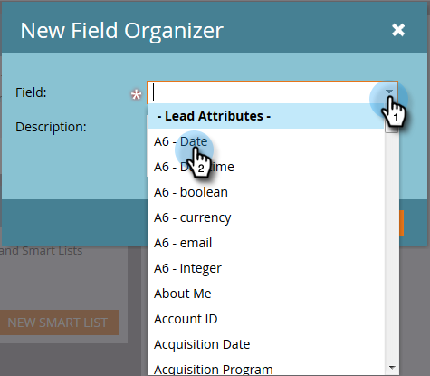

# Använda fältorganisatörer {#using-field-organizers}

Fältorganisatörer hjälper dig att ange vissa fält av alla möjliga värden. Du kan till exempel skapa meningsfulla grupperingar, som västkusten och östkusten, för fältet Territorium. Detta hjälper rapporter att gå snabbare.

Fältorganisatörer liknar segmenteringar, som används allmänt, men fältorganisatörer används för rapportering på fältnivå.

Du kan ha upp till tre anpassade segmenteringar i en fältlista.

Det finns ingen specifik rapport för fältorganisatörer.

Fältorganisatörer används i modellprestandaanalys.

## Så här skapar du fältorganisatörer {#how-to-create-field-organizers}

1. Klicka på **[!UICONTROL Database]**.

   

1. Välj **[!UICONTROL New]** under **[!UICONTROL New Field Organizer]**.

   

1. Välj ett attribut under **[!UICONTROL Field]**. Beskrivningen är valfri.

   

1. Klicka på **[!UICONTROL Create]**.

   

1. Ge gruppen ett namn och ange data (detta beror på datatypen för det markerade fältet). Klicka på **[!UICONTROL Add Group]**.

   

Skapa fler fältorganisatörer på samma sätt om du behöver dem. Och där är du.

>[!MORELIKETHIS]
>
>[Skapa anpassade fältgrupper med fältorganiseraren](/help/marketo/product-docs/reporting/revenue-cycle-analytics/revenue-tools/field-organizers/create-custom-field-groups-using-the-field-organizer.md)
