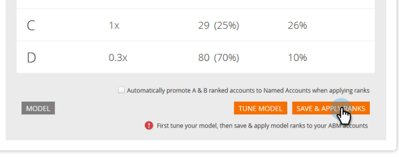

# Rankning och justering av kontoprofilering {#account-profiling-ranking-and-tuning}

Kontoprofilering identifierar din Ideal Customer Profile (ICP), rangordnar företag i din databas baserat på ICP och lägger till ICP-indikatordata till konton som marknadsförs som [!UICONTROL Named Accounts].

>[!IMPORTANT]
>
>Från och med 2025 är kontoprofilering inte längre tillgängligt för nya användare. Det fortsätter att fungera för befintliga användare.

## Modellresultat {#model-results}

Resultaten visar alla dina kända konton uppdelade efter grad. A är av högsta klass, D är den lägsta.

Även om det är valfritt rekommenderar vi att du markerar kryssrutan Automatiskt befordra eftersom du då sparar mycket tid. Men om du vill gå igenom varje konto och [lägga till dem manuellt](/help/marketo/product-docs/target-account-management/target/named-accounts/discover-accounts.md#discover-crm-accounts) lämnar du bara rutan avmarkerad.

<table>
 <tbody>
  <tr>
   <td><strong>Rankning</strong></td>
   <td>
    

      Kontorangordningen baseras på kundprofilen Ideal. A är bäst, D är minst passad.
    
</td>
  </tr>
  <tr>
   <td><strong>Propensitet</strong></td>
   <td>
    

      Uppskattad ökning av konverteringsgraden jämfört med ett icke-ICP-baserat urval av konton.
    
</td>
  </tr>
  <tr>
   <td><strong>Konton (%)</strong></td>
   <td>
    

      Procentandel konton i modellindata som har den här rangordningen.
    
</td>
  </tr>
  <tr>
   <td><strong>% av modellbasen</strong></td>
   <td>
    

      Procent av konton i modellbasen som har den här rangordningen.
    
</td>
  </tr>
 </tbody>
</table>

## Modelljustering {#model-tuning}

Klicka på knappen **[!UICONTROL Tune Model]** på fliken Modell.

Det finns flera flikar att välja mellan, vilket möjliggör en djupgående anpassning.

**Indikatorkategorier**

<table>
 <tbody>
  <tr>
   <td><strong>Regelefterlevnad</strong></td>
   <td>
    

      Certifieringar, regelefterlevnadsrelaterade positioner/anställning.
    
</td>
  </tr>
  <tr>
   <td><strong>Användning</strong></td>
   <td>
    

      Driftsrelaterade positioner/anställning.
    
</td>
  </tr>
  <tr>
   <td><strong>HR</strong></td>
   <td>
    

      HR- eller löneprogramvara, HR-relaterade befattningar/anställning.
    
</td>
  </tr>
  <tr>
   <td><strong>Teknik</strong></td>
   <td>
    

      Teknik, ramverk, ingenjörsrelaterade positioner/anställning.
    
</td>
  </tr>
  <tr>
   <td><strong>Försäljning</strong></td>
   <td>
    

      Lösningar och programvara för försäljning, försäljningsrelaterade positioner/anställning.
    
</td>
  </tr>
  <tr>
   <td><strong>Återgivning</strong></td>
   <td>
    

      Avfallsindikatorer.
    
</td>
  </tr>
  <tr>
   <td><strong>IT</strong></td>
   <td>
    

      Maskinvaru- och programvarulösningar, tekniker, IT-relaterade befattningar/anställning.
    
</td>
  </tr>
  <tr>
   <td><strong>Ekonomi</strong></td>
   <td>
    

      Ekonomisk programvara, finansiella tjänster/anställning.
    
</td>
  </tr>
  <tr>
   <td><strong>Marknadsföring</strong></td>
   <td>
    

      Marknadsföringsteknologier och programvara, marknadsrelaterade befattningar/anställning.
    
</td>
  </tr>
  <tr>
   <td><strong>Business</strong></td>
   <td>
    

      Forbes eller Inc listings eller Business Partnership.
    
</td>
  </tr>
  <tr>
   <td><strong>Kundupplevelser och relationer</strong></td>
   <td>
    

      Kundframgångar och kundrelationer befattningar/anställning.
    
</td>
  </tr>
 </tbody>
</table>

Håll pekaren över verktygstipsen om du vill se en beskrivning av varje kolumn.

Klicka på listrutan [!UICONTROL Add ICP Indicator] för att infoga ytterligare indikatorer i modellen.

Om du markerar rutan [!UICONTROL Export] kan du se ICP-indikatorn på informationssidan för [!UICONTROL Named Account] och använda den valda ICP-indikatorn som begränsningar i [namngivna kontofilter](/help/marketo/product-docs/target-account-management/engage/account-filters.md).

>[!NOTE]
>
>ICP-indikatorer inkluderas som begränsningar i **[!UICONTROL Member of Named Account]**-filter och utlösare.

[!UICONTROL Indicator Weightage] är den prioritetsnivå som varje indikator får i din modell.

Klicka på **[!UICONTROL Refresh Model]** för att ändringarna ska börja gälla.

När du är klar med att justera modellen (efter att du har uppdaterat den) går du tillbaka till fliken Modellresultat och klickar på **[!UICONTROL Save & Apply Ranks]**.

