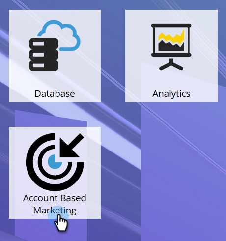

# Konfigurera kontoprofilering {#setting-up-account-profiling}

Följ de här stegen för att börja använda kontoprofilering.

1. I My Marketo öppnar du **Account Based Marketing**.

   

1. Klicka på fliken Kontoprofilering.

   

1. Fliken Modell öppnas som standard. Klicka på **Kom igång**.

   

1. Ge modellen ett namn, välj vem som ska inkluderas i resultaten och vem som ska fungera som bas för den idealiska kundprofilen (ICP). Klicka på **Skapa modell** när du är klar.

   

1. Modellen börjar byggas. Det kan ta en stund, men oroa dig inte. Du meddelas när det är klart.

   

1. Om du vill visa resultatet av modellen klickar du på **Se Modellresultat**.

   

   Din modell har skapats.

   

   >[!TIP]
   >
   >[Lär dig hur du justerar modellen](/help/marketo/product-docs/target-account-management/account-profiling/account-profiling-ranking-and-tuning.md) när du har skapat modellen.
