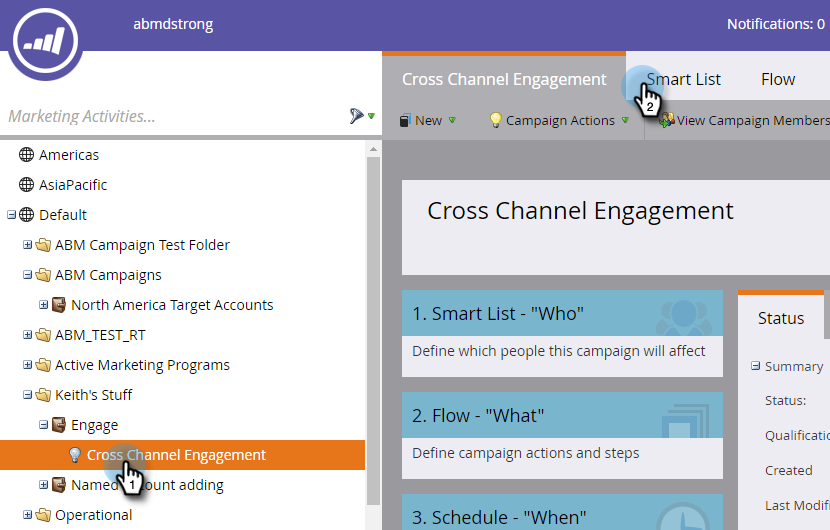
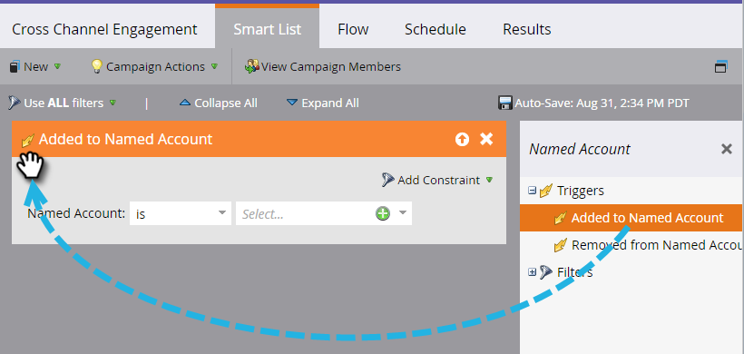
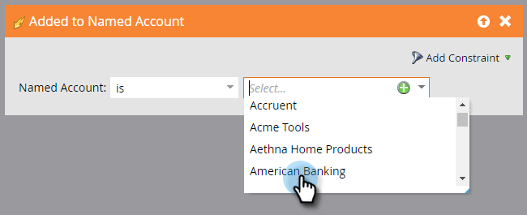

# Kontoutlösare {#account-triggers}

Lyssna på och agera utifrån viktiga beteendeaktiviteter på kontonivå i olika kanaler (t.ex. e-post, webben, annonser) med hjälp av utlösare på kontonivå.

Välj din smarta kampanj och klicka på **[!UICONTROL Smart List]**.

Ange [!UICONTROL Named Account] i sökrutan för att hitta båda [!UICONTROL Named Account]-utlösarna.

Dra utlösaren till arbetsytan. I det här exemplet använder vi _[!UICONTROL Added to Named Account]_.

Välj en kvalificerare.

Klicka på listrutan med namngivna konton...

...och välj ett eller flera namngivna konton.

Så ja! När du är klar med resten av din smarta kampanj måste du aktivera den.

>[!MORELIKETHIS]
>
>[Kontofilter](/help/marketo/product-docs/target-account-management/engage/account-filters.md)
