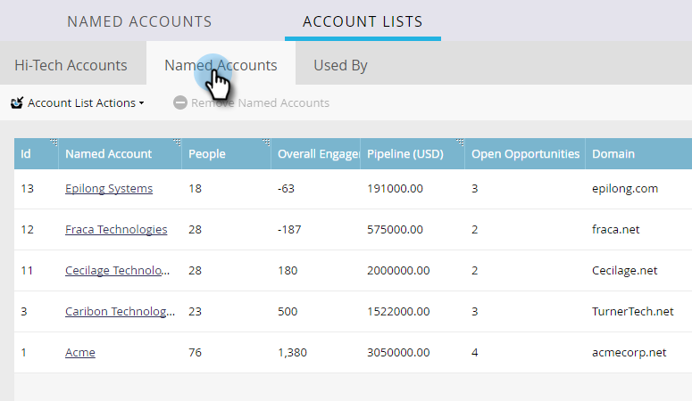
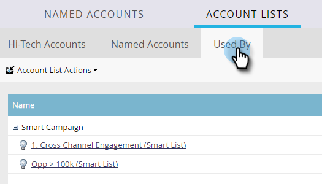

# Kontolisteinsikter {#account-list-insights}

Kontrollpanelen Kontolista ger en översikt över sammanställda insikter från alla namngivna konton i den listan.

>[!NOTE]
>
>Marketo TAM fastställer automatiskt de högst namngivna kontona i en kontolista baserat på pipeline-genererade poäng eller poäng för kontoengagemang.

## Kontrollpanel för kontolista {#account-list-dashboard}

Om du vill visa kontrollpanelen för en kontolista klickar du bara på dess namn...

...och kontrollpanelen visas.

<table>
 <tbody>
  <tr>
   <td colspan="1"><strong>Pipeline</strong></td>
   <td colspan="1">Se rörledningen över tiden. För att bestämma rörledningen över tid i vecka tar vi rörledningen på sista dagen.</td>
  </tr>
  <tr>
   <td><strong>Intäkter</strong></td>
   <td>
Se intäkterna över tid. För att fastställa intäkter över tid och vecka tar vi summan av alla intäkter som vunnits den veckan.
</td>
  </tr>
 </tbody>
</table>

## Fliken Namngivna konton {#named-accounts-tab}

Klicka på fliken **[!UICONTROL Named Accounts]** för att se vilka namngivna konton som tillhör den kontolistan.

>[!NOTE]
>
>Du kan ta bort ett namngivet konto på den här fliken genom att markera det och klicka på **[!UICONTROL Remove Named Accounts]**.

## Fliken [!UICONTROL Used By] {#used-by-tab}

Klicka på fliken **[!UICONTROL Used By]** för att se vilka resurser som refererar till den kontolistan.

