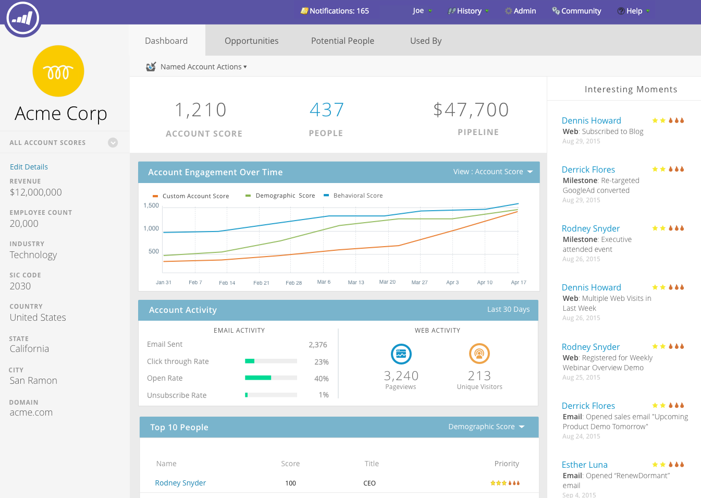

# TAM Main Dashboard {#tam-main-dashboard}

Huvudinstrumentpanelen innehåller en sammanfattning av dina [!UICONTROL Target Account Management]-ansträngningar. Du kan se målkontona eller kontolistorna som är framgångsrika och de som behöver mer uppmärksamhet.

Om du vill filtrera efter kontolista klickar du på listrutan **[!UICONTROL View]**...

...och gör en markering. I det här exemplet väljer vi vår **[!UICONTROL High Tech]**-kontolista.

Om du vill visa kontrollpanelen [Kontolista](/help/marketo/product-docs/target-account-management/measure/account-list-insights.md#account-list-dashboard) klickar du på namnet på den kontolista du har valt..

...och instrumentpanelen läses in.

Om du inte vill visa kontrollpanelen för kontolistan utan vill gå igenom ett namngivet konto klickar du på **[!UICONTROL More Details]** under namnet..

...och visa det [namngivna kontots insikter](/help/marketo/product-docs/target-account-management/measure/named-account-insights.md).

