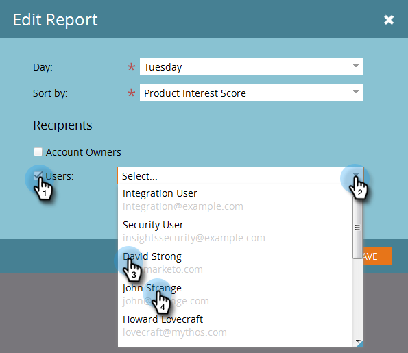

# Inställningar för TAM-rapport {#tam-report-setup}

TAM:s försäljningsrapport är ett personligt e-postmeddelande som skickas till kontoteamet varje vecka.

## Rapportinställningar {#report-setup}

1. Klicka **Administratör**.

   

1. Klicka **Hantering av målkonto**.

   

1. Klicka på under Veckorapport **Redigera**.

   

1. Klicka på **Dag** och välj den dag i veckan som du vill att mottagarna ska få e-postmeddelandet.

   

1. Klicka på knappen **Sortera efter** och gör en markering.

   

1. Kontrollera **Användare** markerar du kryssrutan och klickar sedan på listrutan och väljer vem du vill få e-postmeddelandet.

   

   >[!NOTE]
   >
   >Meddelanden skickas endast till kontoägare eller teammedlemmar.

1. Klicka **Spara**.

   

Och det är allt!

## Så här säger du upp prenumerationen {#how-to-unsubscribe}

Varje rapport har möjligheten att avanmäla sig. Det gör du genom att klicka **Avbeställ** längst ned i e-postmeddelandet.

## Så här återprenumererar du {#how-to-resubscribe}

1. Klicka **Administratör**.

   

1. Klicka **Hantering av målkonto**.

   

1. Under Veckorapport klickar du på numret som visas som Avbeställ.

   

1. Klicka på **Användare** nedrullningsbar meny.

   

1. Välj den användare som du vill ska få e-post igen och klicka på **Återprenumeration**.

   
