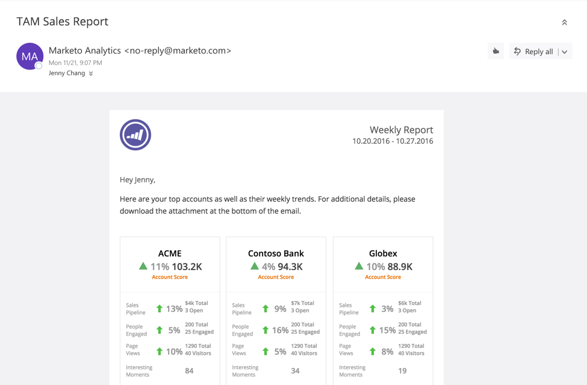

# TAM-försäljningsrapport {#tam-sales-report}

Ta emot ett e-postmeddelande varje vecka som innehåller de viktigaste kontona och deras vecktrender.

>[!NOTE]
>
>Lär dig hur du konfigurerar den här rapporten [här](/help/marketo/product-docs/target-account-management/measure/tam-report-setup.md).

Rapporten delar:

* Namngivna konton sorterade efter det kontopoäng du väljer
* Mest engagerade
* Viktiga trender och intressanta ögonblick
* En länk för att hämta en CSV-fil med ytterligare information

## Försäljningsrapportnyckel {#sales-report-key}

<table> 
 <tbody> 
  <tr> 
   <td><strong>Kontopoäng</strong></td> 
   <td> 
    

      Trend varje vecka efter kontopoäng (väljs i konfiguration), följt av aktuellt kontopoäng 
    
</td> 
  </tr> 
  <tr> 
   <td><strong>Försäljningsförlopp</strong></td> 
   <td> 
    

      Trend varje vecka efter pipeline, följt av den totala aktuella pipeline och antalet öppna möjligheter 
    
</td> 
  </tr> 
  <tr> 
   <td><strong>Sidvyer</strong></td> 
   <td> 
    

      Veckovis trend för sidvisningar, följt av totalt antal sidvisningar och unika besökare 
    
</td> 
  </tr> 
  <tr> 
   <td><strong>Intressanta ögonblick</strong></td> 
   <td> 
    

      Totalt antal intressanta stunder som har inträffat under veckan 
    
</td> 
  </tr> 
 </tbody> 
</table>