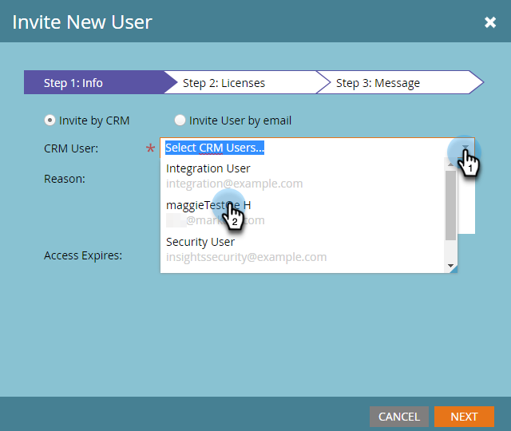

# Bjud in användare att få åtkomst till kontoinsikter {#invite-users-to-access-account-insight}

Följ de här stegen för att ge användarna åtkomst till Account Insight.

1. Klicka **Administratör**.

   

1. Klicka **Användare och roller** i trädet. Klicka sedan på **Försäljningsanvändare** och **Bjud in ny säljare**.

   

   Det finns två sätt att bjuda in användare: Per CRM eller via e-post. I det här exemplet använder vi Bjud in från CRM.

   >[!NOTE]
   >
   >När du bjuder in nya (icke-Marketo) användare via användarlistan i CRM kan du bjuda in flera personer åt gången. Inbjudan via e-post är 1 för 1.

1. Klicka på **CRM-användare** och välj önskad användare.

   

   >[!NOTE]
   >
   >Om du väljer **Bjud in användare via e-post** anger du bara förnamn, efternamn och e-postadress och fortsätter till steg 4.

1. Om du vill ange ett förfallodatum för användarens åtkomst (valfritt) klickar du på kalenderikonen. Som standard är den inställd på&quot;aldrig&quot;.

   

1. Klicka **Nästa**.

   

1. Kontrollera **Kontoinsikt** kryssruta och klicka **Nästa**.

   

1. Titta på skicka-meddelandet, gör önskade ändringar (valfritt) och klicka på **Skicka**.

   
