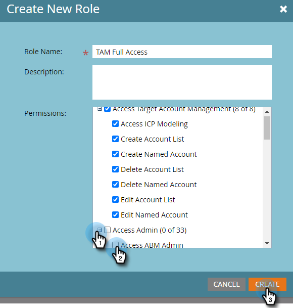

# Behörigheter {#permissions}

Du måste konfigurera behörigheter för dina användare för att kunna använda TAM. Så här gör du.

1. Klicka **Administratör**.

   

1. Klicka **Användare och roller**.

   

   >[!NOTE]
   >
   >Du kan lägga till TAM-behörigheter för en befintlig roll eller skapa en helt ny. I det här exemplet används en ny roll.

1. Klicka **Roller** sedan **Ny roll**.

   

1. Ange ett rollnamn och klicka på **+** -ikonen bredvid kryssrutan Kontohantering för Access Target.

   

1. Välj _alla_ behörigheter, kontrollera bara **Kontohantering för Access Target** kryssrutan.

   

   >[!NOTE]
   >
   >Du kan också välja att bara välja vissa av alternativen. Gör det genom att markera varje kryssruta för sig.

1. Klicka på **+** för att öppna menyn Åtkomstadministratör. Kontrollera **Åtkomst till ABM Admin** kryssruta (ABM är föregående namn för TAM) och klicka på **Skapa**.

   

   Din nya TAM-roll är nu klar att användas [tilldelad till en användare](/help/marketo/product-docs/administration/users-and-roles/managing-user-roles-and-permissions.md#assign-roles-to-a-user)!
