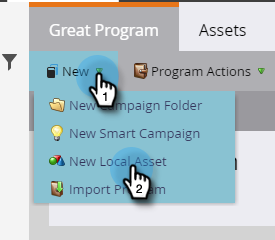

# Smarta kontouppsättningar {#account-smart-lists}

Så här identifierar du snabbt och korrekt dina värdefulla konton.

>[!NOTE]
>
>Den här funktionen är bara tillgänglig för dem som har både tillägget [!UICONTROL Target Account Management] och en licensierad TAM.

## Skapa en [!UICONTROL Account Smart List] {#create-an-account-smart-list}

1. Gå till **[!UICONTROL Marketing Activities]** i Marketo.

   

1. Hitta och välj önskat program.

   

1. Klicka på listrutan **[!UICONTROL New]** och välj **[!UICONTROL New Local Asset]**.

   

1. Klicka på **[!UICONTROL Account Smart List]**.

   

1. Ange ett namn och klicka på **[!UICONTROL Create]** (Beskrivning och Etiketter är valfria).

   

[!UICONTROL Account Smart List] har skapats! Anvisningar om hur du definierar regler finns nedan.

## Regler för [!UICONTROL Account Smart List] {#account-smart-list-rules}

[!UICONTROL Account Smart Lists] fungerar på ungefär samma sätt som vanliga smarta listor, med ett betydande undantag: behållare.

1. Klicka på fliken [!UICONTROL Account Smart List] om du vill definiera **[!UICONTROL Account Smart List Rules]**.

   

1. Välj önskade kontofilter. I det här exemplet är _[!UICONTROL Industry][!UICONTROL Healthcare]_.

   

   

   >[!NOTE]
   >
   >ICP-indikatordata som användes i din [kontoprofileringsrankning och justering](/help/marketo/product-docs/target-account-management/account-profiling/account-profiling-ranking-and-tuning.md) visas som anpassade kontoattribut som kan användas i din smarta kontolista. Dessa anpassade attributdata baseras på när kontoprofilmodellen skapades/uppdaterades.

1. Välj matchande personfilter. I det här exemplet väljer vi _Delstaten är Kalifornien_.

   

**VALFRITT STEG**: Här kommer behållare in. Om du väljer ytterligare ett Matchat personfilter kan du släppa det under det första, eller _i_ det, och skapa en behållare. I det här exemplet skapar vi en behållare genom att lägga till _Jobbtiteln är CFO_.

Så här ser behållaren ut.

>[!NOTE]
>
>Om du skapar en behållare med filter skapas en&quot;och&quot;-regel, vilket innebär att den bara returnerar alla resultat som kombineras. I det här exemplet har en vårdbransch som tillsammans med en annan i Kalifornien _och_ har någon som är listad som CFO. Om du inte vill använda behållare släpper du bara filtret nedanför/ovanför det befintliga.

Och det är allt! Titta i avsnittet nedan för att se hur du kan utnyttja din [!UICONTROL Account Smart List].

>[!TIP]
>
>Precis som med vanliga smarta listor kan du använda avancerad logik för att förfina resultaten ytterligare. Du behöver minst tre filter för att göra det, och i [!UICONTROL Account Smart Lists] är en behållare (oavsett hur många filter den innehåller) lika med ett filter.

## [!UICONTROL Account Smart List] åtgärder {#account-smart-list-actions}

På fliken Översikt i [!UICONTROL Account Smart List] ser du några åtgärdsalternativ.

**[!UICONTROL Export]**: Detta exporterar resultaten av din [!UICONTROL Account Smart List] som en CSV.

**[!UICONTROL Clone]**: Skapar en kopia av din [!UICONTROL Account Smart List].

**[!UICONTROL Send to Ad Network]**: Skickar listan till [!DNL LinkedIn] som en ny matchad publik.

Du kan också referera till din [!UICONTROL Account Smart List] i en standardlista för smarta kampanjer/listor genom att använda filtret _[!UICONTROL People Member of Account Smart List]_.

>[!NOTE]
>
>Resultaten av [!UICONTROL People Member of Account Smart List] visar alla personer i de identifierade kontona, inte bara personer som hittas via matchade personfilter i den smarta listan över konton.

>[!NOTE]
>
>**Definition**
>
>**[!UICONTROL People Member of Account Smart List]**: I det här fallet refererar ordet &quot;medlem&quot; till själva kontot, så &quot;personmedlem&quot; betyder de faktiska personerna (Marketo-poster) i dessa konton.
