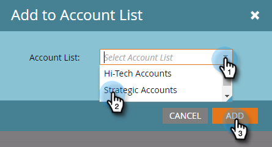

# Lägg till en befintlig [!UICONTROL Named Account] i en kontolista {#add-an-existing-named-account-to-an-account-list}

Det är enkelt att lägga till ett namngivet konto i en kontolista.

>[!NOTE]
>
>Detta gäller endast kontolistor, **inte** dynamiska kontolistor.

1. Markera raden för det namngivna konto som du vill lägga till i.

   

1. Klicka på listrutan **[!UICONTROL Named Account Actions]** och välj **[!UICONTROL Add to Account List]**.

   

1. Klicka på listrutan **[!UICONTROL Account List]**, markera önskad kontolista och klicka på **[!UICONTROL Add]**.

   

   Så ja!

>[!MORELIKETHIS]
>
>[Skapa en [!UICONTROL Named Account]](/help/marketo/product-docs/target-account-management/target/named-accounts/create-a-named-account.md)
