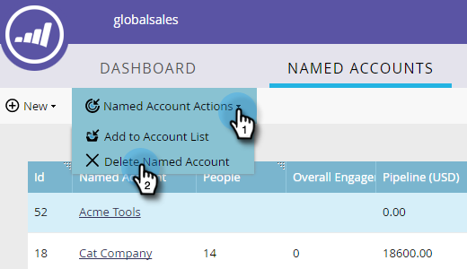

# Ta bort en [!UICONTROL Named Account] {#delete-a-named-account}

Följ de här snabbstegen för att ta bort ett namngivet konto.

1. Markera raden med namngivna konton som du vill ta bort.

   

   >[!NOTE]
   >
   >Ctrl-klicka (Windows) eller Kommando-klicka (Mac) om du vill markera flera namngivna konton.

1. Klicka på listrutan **[!UICONTROL Named Account Actions]** och välj **[!UICONTROL Delete Named Account]**.

   

1. Klicka på **[!UICONTROL Delete]**.

   

   >[!NOTE]
   >
   >Konton som har synkroniserats med CRM kan inte tas bort i TAM. Om raderingsalternativet inte är tillgängligt, eller om du får meddelandet&quot;Dessa konton kan inte tas bort eftersom ett eller flera CRM-konton har valts&quot;, måste de tas bort direkt i CRM.
