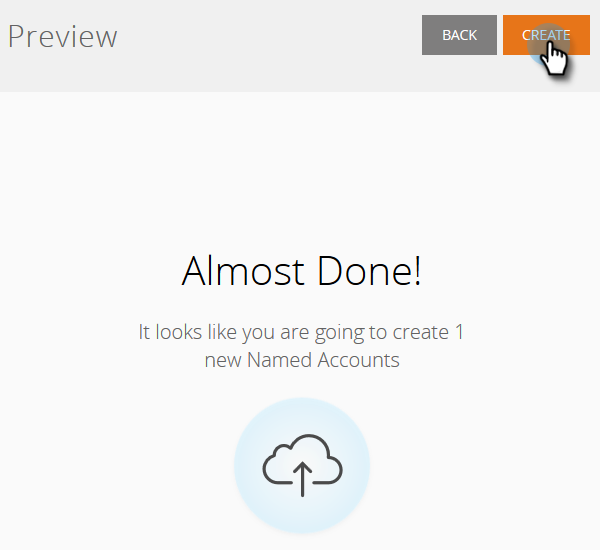

# Identifiera konton {#discover-accounts}

Använd alternativet Discover för att identifiera potentiella målkonton.

## [!UICONTROL Discover CRM Accounts] {#discover-crm-accounts}

Identifiera potentiella målkonton från CRM.

>[!NOTE]
>
>När du har anslutit CRM till Marketo TAM visar **[!UICONTROL Discover CRM Accounts]** alla CRM-konton och relevant information som hjälper dig att välja rätt namngivna konton. Marketo lägger till ytterligare information utöver vad som tas emot från CRM.

**[!UICONTROL People]** (i [!UICONTROL Discover CRM Accounts] &amp; [!UICONTROL Discover Marketo Companies]): Innehåller både kontakter och leads. Leads kan identifieras med Marketo [lead-to-account-matchning](/help/marketo/product-docs/target-account-management/target/named-accounts/lead-to-account-matching.md).

**[!UICONTROL Potential People]** (I [!UICONTROL Discover CRM Accounts] &amp; [!UICONTROL Discover Marketo Companies]): Visar hur många leads Marketo hittade som eventuellt kan tillhöra ett CRM-konto.

**Anpassat CRM-fält** (endast i Identifiera CRM-konton): Detta hjälper dig att justera din försäljnings- och marknadsföringsorganisation för att välja rätt målkonton. När du har [mappat det anpassade CRM-fältet](/help/marketo/product-docs/target-account-management/setup-tam/create-a-custom-field-for-crm-discovery.md) med Marketo TAM visar vi mappade data som hjälper dig att identifiera målkonton.

1. I [!UICONTROL Named Accounts] klickar du på listrutan **[!UICONTROL New]** och väljer **[!UICONTROL Discover CRM Accounts]**.

   

1. Ett nytt fönster/en ny flik öppnas. Markera det eller de CRM-konton som du vill lägga till i [!UICONTROL Named Accounts] och klicka på **[!UICONTROL Next]**.

   

1. Förhandsgranskningsskärmen bekräftar hur många markeringar du har gjort. Klicka på **[!UICONTROL Create]**.

   

   Det är allt som finns till det!

   

## [!UICONTROL Discover Marketo Companies] {#discover-marketo-companies}

Identifiera rätt företag för målinriktning.

>[!NOTE]
>
>Om [!UICONTROL Discover Marketo Companies] visas Marketo-företag som inte kommer från din CRM.

1. I [!UICONTROL Named Accounts] klickar du på listrutan **[!UICONTROL New]** och väljer **[!UICONTROL Discover Marketo Companies]**.

   

1. Ett nytt fönster/en ny flik öppnas. Välj de företag som du vill lägga till i din [!UICONTROL Named Accounts] och klicka på **[!UICONTROL Next]**.

   

   >[!NOTE]
   >
   >I [!UICONTROL Discover Marketo Companies] och Identifiera CRM, Marketo automatiskt:
   >
   >* Söker efter personer från din Marketo-databas som har det företaget angivet i sin lista. Om du ser flera värden för vissa attribut (t.ex. Bransch) beror det på att Marketo hittade olika värden för de enskilda personerna. Attributet med flest träffar
   >
   >I **Identifiera endast CRM**, Marketo automatiskt:
   >
   >* Synkroniserar och associerar CRM-kontakter med [!UICONTROL Named Account]
   >
   >Endast i **[!UICONTROL Discover Marketo Companies]**: Marketo automatiskt:
   >
   >* Filtrerar ut de flesta Internetleverantörer och offentliga domäner (t.ex. yahoo.com, gmail.com) som företagsnamn
   >
   >* Tar bort CRM-konton. Om du har &quot;Acme&quot; i en post och &quot;Acme Inc&quot; (eller något av följande suffix: Co, Corp, Corporation, GmbH, Inc, Incorporated, LLC, LLP, LP, Ltd, PA, PC, PLC, PLLC), sammanfogar vi dem i TAM som &quot;Acme&quot;

1. Klicka på nedpilen under kolumnen [!UICONTROL Named Account] för att visa listrutan.

   

   >[!CAUTION]
   >
   >Framöver kommer alla nya personer från dessa utvalda företag automatiskt att tilldelas sina respektive namngivna konton. Kontrollera dessa företag och se till att de har tilldelats rätt [!UICONTROL Named Account].

1. Om du vill välja ett befintligt konto klickar du på listrutan **[!UICONTROL Named Account]**, väljer önskat konto och klickar sedan på **[!UICONTROL Next]**.

   

   Du kan också skapa en ny [!UICONTROL Named Account] genom att skriva det önskade namnet direkt i listrutan. Klicka utanför rutan när du är klar..

   

   ...så ser du din nya [!UICONTROL Named Account]. Då klickar du bara på **[!UICONTROL Next]**, som i steg 4.

   

1. Klicka på **[!UICONTROL Create]**.

   

   Snyggt jobbat!

   

>[!NOTE]
>
>Om det finns en felmatchning mellan de CRM-konton du har valt och det som finns i Identifiera CRM-stödraster beror det troligen på ett eller flera av följande:
>
>* Har olika CRM-konton med liknande namn som har tagits bort
>* Nästa schemalagda synkronisering har inte utförts än

>[!MORELIKETHIS]
>
>[Lead till kontomatchning](/help/marketo/product-docs/target-account-management/target/named-accounts/lead-to-account-matching.md)
