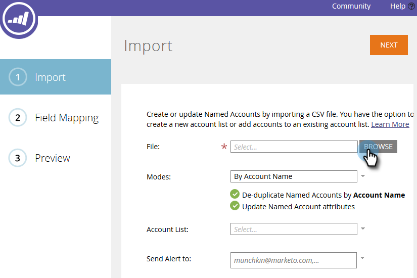
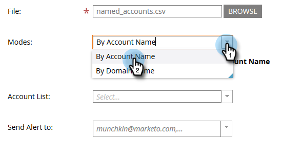

# Importera [!UICONTROL Named Accounts] {#import-named-accounts}

Har du redan en CSV-fil full med potentiella målkonton? Importera dem direkt till TAM!

1. Klicka på listrutan **[!UICONTROL New]** och välj **[!UICONTROL Import Named Accounts]**.

   

1. Ett nytt fönster öppnas. Klicka på **[!UICONTROL Browse]** och markera sedan filen med namngivna konton som du vill importera.

   

   >[!TIP]
   >
   >Ange [så mycket information](/help/marketo/product-docs/target-account-management/target/named-accounts/named-account-overview.md#named-account-attributes) som möjligt i filen. Du kan bara lägga till firmografisk information. Det finns inga Marketo-beräkningar (dvs. Pipeline). Om du vill skapa namngivna konton baserat på CRM-konton exporterar du bara kontonamnet och CRM-ID:t från CRM till en CSV-fil, använder alternativet Kontonamn och mappar CRM-ID:t under importprocessen. Om du vill länka ett CRM-konto till ett namngivet konto måste du ange CRM-kontots exakta namn.

1. Välj mellan två borttagningslägen: Kontonamn eller Domännamn. I det här exemplet väljer vi Konto. Klicka på listrutan **[!UICONTROL Modes]** och välj **[!UICONTROL By Account Name]**.

   

   >[!NOTE]
   >
   >Om du väljer **[!UICONTROL By Domain Name]** måste både namngivna konto- och domänfält inkluderas.

1. Om du vill välja vilken kontolista ditt namngivna konto ska läggas till i klickar du på listrutan **[!UICONTROL Account List]** och gör ditt val.

   

   >[!NOTE]
   >
   >Du kan också skapa ett helt nytt [!UICONTROL Account List] genom att skriva namnet i listrutan.

1. Om du vill skicka ett meddelande om importen klickar du på listrutan **[!UICONTROL Send Alert To]** och väljer en Marketo-användare. Du _kan inte_ ange en e-postadress manuellt.

   

1. Klicka på **[!UICONTROL Next]**.

   

1. Mappa varje fält genom att dubbelklicka på listrutan **[!UICONTROL Marketo Field]** och välja rätt fält. Klicka på **[!UICONTROL Next]** när du är klar.

   

   Klart!

   

   >[!NOTE]
   >
   >&quot;Kontrollera importstatus&quot; visar endast de tre senaste aktivitetsdagarna.

Scenarier när du tar bort [!UICONTROL by Account Name]:

<table>
 <tbody>
  <tr>
   <td><strong>Importerar post med befintligt namn på konto</strong></td>
   <td>
Vi uppdaterar den befintliga posten
</td>
  </tr>
  <tr>
   <td><strong>Importerar post med nytt namn för namngivet konto</strong></td>
   <td>Vi ska skapa en ny post</td>
  </tr>
 </tbody>
</table>

Scenarier när du tar bort [!UICONTROL by Domain Name]:

<table>
 <tbody>
  <tr>
   <td><strong>Importerar post med ett nytt kontonamn och ett nytt domännamn</strong></td>
   <td>Vi skapar ett nytt namngivet konto med den angivna informationen</td>
  </tr>
  <tr>
   <td><strong>Importerar post med ett befintligt kontonamn och befintligt domännamn</strong></td>
   <td>Vi uppdaterar det befintliga namngivna kontot</td>
  </tr>
   <tr>
   <td><strong>Importerar post med ett nytt kontonamn och befintligt domännamn</strong></td>
   <td>Vi lägger till det nya kontonamnet till det befintliga namngivna kontot som matchar domännamnet och uppdaterar annan information (t.ex. bransch, stat)</td>
  </tr>
  <tr>
   <td><strong>Importerar post med befintligt namn på konto och nytt domännamn</strong></td>
   <td>Vi lägger till det nya domännamnet till det befintliga namngivna kontot som matchar kontonamnet och uppdaterar annan information (t.ex. bransch, stat)</td>
  </tr>
 </tbody>
</table>

>[!NOTE]
>
>När Marketo lägger till ett namngivet konto uppdaterar vi en regel (bakom kulisserna) som gör att vi kan identifiera personer som ska vara en del av [!UICONTROL Named Account]. Exempel: Om du uppdaterar &quot;IBM&quot; till &quot;IBM, USA&quot; kopplas personer med något av företagsnamnen till [!UICONTROL Named Account].

Om Marketo hittar poster som vi ser som dubbletter bearbetar vi bara den första.
