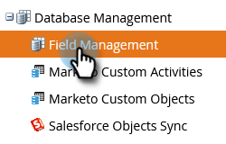
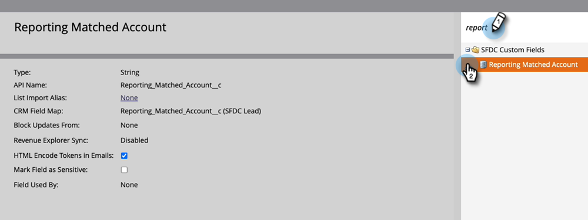

# Lead till kontomatchning {#lead-to-account-matching}

Matcha högerleads till högernamngivna konton med Marketo Lead-to-Account-matchning.

>[!NOTE]
>
>**Matchning av lead-till-konto** är en inbyggd funktion i Marketo Target Account Management. Den använder otydlig logik för att automatiskt matcha leads till rätt namngivna konton i nära realtid. Dessa namngivna konton kan vara CRM-konton eller Marketo-företag.

## Översikt {#overview}

Marketo Lead-to-Account Matching följer en process i fyra steg:

**Steg 1 -** Vår matchningsprocess börjar med att använda nyckelinformation på lead-poster, som:

* E-postdomän (t.ex. acme.com)
* Infört företagsnamn från IP-adress
* Företagsnamn - Detta kan vara CRM-kontonamn eller huvudföretagets namnattribut (t.ex. kommer från formulärifyllning)

**Steg 2 -** Vi normaliserar företagsnamnen som vi hittar baserat på olika leadattribut (t.ex. Acme Inc. och Acme Corp normaliseras automatiskt till Acme). Detta steg gör att vi har en enda representation av det namngivna kontot i Marketo och kan se alla leads i ett namngivet konto.

**Steg 3 -** Vi delar matchade leads i två grupper: Stark Match och Weak Match.

* Svag matchade leads visas på de namngivna kontona och kan sedan lösas manuellt.

**Steg 4 -** Vi presenterar en lista över föreslagna företag med starka och svaga träffar. När ett namngivet konto skapas baserat på ett av de föreslagna företagen skapar vi matchningsregler som automatiskt kopplar nya leads (t.ex. lead fill out a form) till höger namngivna konton. På det här sättet kan du oroa dig mindre för att matcha leads och mer för att få intäkter!

Eftersom matchning av lead-till-konto i Marketo är en inbyggd funktion i Marketo Target Account Management sker matchning av leads till konton i nära realtid (t.ex. så fort ett lead fyller i ett Marketo-formulär, associerar vi detta lead med rätt namngivet konto). Den här händelsen kan användas för att utlösa varningar och meddela kontoägare om nya leads som kommer från deras namngivna konton.

>[!NOTE]
>
>Om du använder LeanData i Salesforce för att matcha lead-till-konto har Marketo en integrering som synkroniserar matchningarna med din Marketo-instans. Om du vill aktivera den funktionen kontaktar du [Marketo Support](https://nation.marketo.com/t5/Support/ct-p/Support) Lär dig hur du konfigurerar LeanData nedan.

## Använda LeanData för Lead till kontomatchning {#using-leandata-for-lead-to-account-matching}

Efter [Marketo Support](https://nation.marketo.com/t5/Support/ct-p/Support) har aktiverat LeanData för ditt konto, följ stegen nedan för att konfigurera det.

1. I Salesforce klickar du på **Startsida** till vänster om navigeringen.

1. Fortfarande i det vänstra navigeringsfältet klickar du under Administration på **Användare** sedan **Profiler**.

1. Leta reda på och markera **Marketo Sync** profil.

1. Bläddra ned till avsnittet Fältnivåsäkerhet och leta upp Lead-objektet. Välj **Visa**.

1. Markera kryssrutan i fältet &quot;Rapporterar matchat konto&quot; **Läsåtkomst** kolumnen är markerad.

1. I Marketo går du till **Administratör** -avsnitt.

   

1. Välj **Fälthantering**.

   

1. Bekräfta att fältet finns där genom att söka efter&quot;Rapporterat matchat konto&quot;.

   

>[!MORELIKETHIS]
>
>[Identifiera konton](/help/marketo/product-docs/target-account-management/target/named-accounts/discover-accounts.md)
