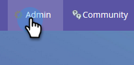

# Använda persona {#using-personas}

Personer är ett bra sätt att segmentera ABM-målgrupper och -marknader för en viss del av människor.

## Lägg till en persona {#add-a-persona}

1. I Min Marketo klickar du på **Administratör**.

   

1. Välj **Hantering av målkonto**.

   

1. Klicka **Redigera**.

   

   >[!NOTE]
   >
   >Jobbtitelspersonalen inkluderas som standard. Den kan inte ändras eller tas bort.

1. Om du vill lägga till fler profiler klickar du på **+Lägg till**.

   

1. Ge din persona ett namn och markera motsvarande fält i listrutan. Du kan lägga till upp till två ytterligare profiler. Klicka **Spara** när det är klart.

   

   >[!NOTE]
   >
   >Endast anpassade Salesforce-fält av typen &quot;picklist&quot; som har synkroniserats med din Marketo-instans är tillgängliga i listrutan för personfält när du skapar en persona.

## Visa dina personuppgifter {#view-your-personas}

Visa dina personuppgifter genom att besöka ett specifikt namngivet konto.

1. Välj önskat namngivet konto.

   

1. Klicka på **Personas** -fliken.

   

1. Alla dina personligheter listas. Klicka på en siffra för att se listan över personer.

   

   >[!NOTE]
   >
   >X:et i Title Persona fungerar som ett jokertecken. &quot;CXO&quot; kommer till exempel att omfatta koncernchef, ekonomichef osv.

## Persona-filter {#persona-filters}

1. Använd personliga filter i en smart lista för att marknadsföra till en viss grupp av människor.

