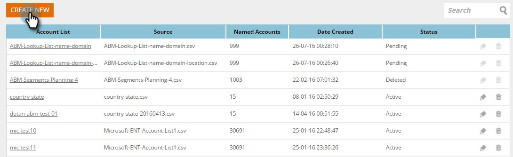

# Skapa en ny kontolista {#create-a-new-account-list}

Skapa och överför en lista över organisations- och domännamn för att rikta in dessa nyckelkonton mot personaliserade kampanjer.

>[!NOTE]
>
>Den här artikeln gäller endast äldre kunder med Web ABM. Om du har köpt Web ABM efter september 2016 ska du följa stegen i [den här artikeln](http://docs.marketo.com/display/DOCS/Account+Lists#AccountLists-CreateaNewAccountList) istället.

## Skapa en ny kontolista {#create-a-new-account-list-1}

1. Gå till **Kontolistor**.

   

1. Välj **Skapa ny**.

   

1. Välj **Bläddra** och överför CSV-filen (kontrollera att CSV-filen uppfyller villkoren). Lägg till ett **namn** och en **beskrivning**. Klicka på **Spara**.

   

   >[!NOTE]
   >
   >**Vilket format har CSV-filen?**
   >
   >
   >Kontrollera att CSV-filen för det namngivna kontot uppfyller följande krav:
   >
   >* Sparat som CSV-format
   >* överstiger inte 10 MB
   >* Endast fyra kolumner med rubriken Kolumn A: Namn, kolumn B: Domän, kolumn C: Land, kolumn D: USA
   >* Det kan ta upp till 2 arbetsdagar innan filen skickas för godkännande.
   >* Du får ett e-postmeddelande om godkännande eller en kontroll av filens status på sidan Namngivna konton.
   >* Det totala antalet poster/rader som ackumulerats för alla dina överförda listor börjar vid 10 000, med det största paketet på totalt 100 000.

   >[!NOTE]
   >
   >**Exempel**
   >
   >**Exempel på CSV-fil**
   >
   >* Rad 1 kolumn A värde = Organisation
   >* Rad 1 kolumn B värde = domän
   >* Rad 1 Kolumn C, värde = Land
   >* Rad 1 kolumn D värde = US State
   >* Ett av kolumnvärdena är obligatoriskt. Men om du anger både organisationsnamn och domännamn förbättras matchningsfrekvenserna i kontolistan.
   >* Land och stat är valfria värden.

      >
      >  
   * Använd det fullständiga landsnamnet eller förkortningskoden för landsnamnet. Exempel: USA eller USA.
   >  * För delstat i USA använder du förkortningskoden med två bokstäver, dvs. CA. Endast delstater i USA känns igen.

   >    
   >

## Redigera en kontolista {#edit-an-account-list}

På sidan **Kontolistor** klickar du på ikonen **Redigera **i listan.

Välj **Bläddra** och överför din nya CSV-fil. Den här filen ersätter originalfilen. Klicka på **Spara**. Den nya överförda filen kommer att vara i ett väntande läge tills den har godkänts av Marketo Support. När den är i ett väntande läge förblir den ursprungliga filen aktiv.

CSV-filen ersätter den befintliga filen. Den befintliga listan förblir aktiv tills bearbetningen av den nya filen är klar.

## Ta bort en namngiven kontolista {#delete-a-named-account-list}

1. På sidan **Kontolistor **klickar du på ikonen **Ta bort **i listan som du vill ta bort.

   

1. Ett meddelande visas som bekräftar om du vill ta bort listan. Klicka på **OK**.

   

>[!NOTE]
>
>**Relaterade artiklar**
>
>* [Skapa ett segment med hjälp av en kontolista](create-a-segment-using-an-account-list.md)
>* [Visa en lista med namngivna konton](http://docs.marketo.com/pages/viewpage.action?pageid=4720244)

