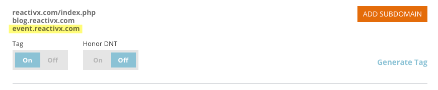

# Lägg till underdomäner i kontoinställningarna {#add-subdomains-in-account-settings}

Så här lägger du till underdomäner i dina primära domäner i Kontoinställningar. På så sätt kan du hantera underdomäner som är relaterade till det specifika RTP Javascript-skriptet för din primära domän. Du bör distribuera Javascript-taggen till alla tillagda underdomäner.

1. Gå till **Kontoinställningar** i Webbanpassning.

   

1. På sidan Domänkonfiguration visas en lista med alla primära domäner som är associerade med ditt konto. I varje avsnitt listas den primära domänen först (markeras nedan), följt av eventuella underdomäner. Klicka på **Lägg till underdomän**.

   

1. Klicka på **Lägg till**.

   

1. Ange underdomän-URL. Klicka på **Lägg till** eller **Ta bort** för att hantera din lista över underdomäner och klicka sedan på **OK** när du är klar.

   

1. Din nytillagda underdomän visas nu.

   

   >[!NOTE]
   >
   >Om du vill lägga till *primära* domäner för ditt konto kontaktar du [Marketo Support](http://docs.marketo.com/cdn-cgi/l/email-protection#5e2d2b2e2e312c2a1e333f2c353b2a31703d3133).

