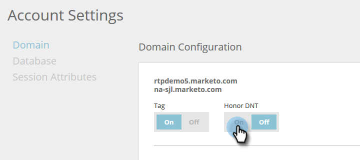

# Anger [!UICONTROL Web Personalization] som Do Not Track (Spåra inte) {#setting-web-personalization-to-do-not-track}

Webbbesökarna kan ställa in sin webbläsare så att de inte kan spåras av någon webbplats genom att välja&quot;Do Not Track&quot; (DNT). Detta förhindrar spårning för just den webbläsaren och enheten.

I [!UICONTROL Web Personalization] och [!UICONTROL Predictive Content] kan en markör ställa in en växlingsknapp som anger om webbläsarens DNT-inställning (Do Not Track) ska stödjas eller ignoreras. Växlingsknappen för konton är inaktiverad som standard, vilket innebär att DNT inte stöds av programmet.

## Aktivera eller inaktivera växlingen {#enable-or-disable-the-toggle}

1. Gå till **[!UICONTROL Account Settings]**.

   

1. I [!UICONTROL Domain] och [!UICONTROL Domain Configuration] väljer du **[!UICONTROL On]** för att aktivera växlingsknappen [!UICONTROL Honor DNT].

   

   När växlingsknappen är inställd på [!UICONTROL On] respekterar och stöder Web Personalization webbläsarens DNT-inställning (Do Not Track) och spårar inte någon webbaktivitet eller kör några kampanjer eller innehållsrekommendationer på webbplatsen.

   >[!NOTE]
   >
   >Om du ställer in växeln på [!UICONTROL On] kan det påverka Marketo värde och funktioner i vissa områden.

1. Om du vill inaktivera inställningen [!UICONTROL Honor DNT] och ignorera webbläsarens DNT-inställning (Do No Track) väljer du **[!UICONTROL Off]** under [!UICONTROL Honor DNT].
