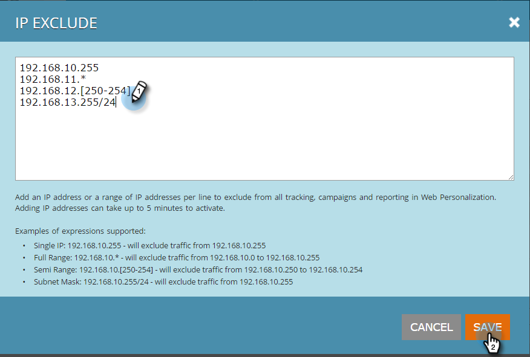

# Undanta specifika IP-adresser från spårning {#exclude-specific-ips-from-being-tracked}

Har du någonsin velat utesluta egna medarbetare och företagsnamn från spårningen och rapporteringen i Webbpersonalisering?

Du kan utesluta enskilda IP-adresser och hela eller delar av ett intervall med IP-adresser.

>[!NOTE]
>
>Den här processen kan ta upp till fem minuter att slutföra.

1. Logga in på Webbanpassning och klicka på **Kontoinställningar** under din inloggning.

   

1. Bläddra ned till området för **IP-undantag** . Om du exkluderar IP-adresser för första gången klickar du i det tomma fältet **Uteslut IP-adresser** .

   

1. Ange de enskilda IP-adresserna eller IP-intervallen som du vill utesluta från spårning och rapportering och klicka på **Spara**.

   

   >[!NOTE]
   >
   >Du kan utesluta en enstaka IPv4- eller IPv6-adress, eller ett fullständigt intervall, halvintervall eller nätmask. Objekten i exemplet ovan visar ett av vart och ett, baserat på de exempel som finns i Marketo-formuläret.

1. Fältet Uteslut IP-adresser visar nu de IP-adresser du angett. Om du vill redigera IP-undantagen klickar du på det gröna plugin-programmet för att öppna formuläret igen.

   

   Såg du hur enkelt det var? Nu kan du exkludera alla data från de IP-adresser som lagts till, antingen individuellt eller efter intervall.

