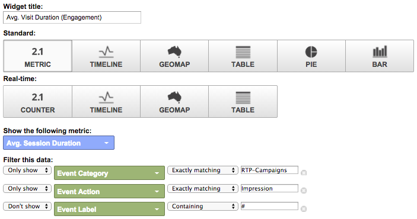

# Anpassade RTP-instrumentpaneler i Google Universal Analytics {#custom-rtp-dashboards-in-google-universal-analytics}

>[!PREREQUISITES]
>
>[Integrera RTP med Google Universal Analytics](integrate-rtp-with-google-universal-analytics.md)

I det här inlägget beskrivs hur du konfigurerar RTP-instrumentpaneler i Google Universal Analytics (GUA).  Data som skickas från RTP till GUA kan konfigureras som två separata anpassade kontrollpaneler som kallas:

* RTP B2B
* RTP-engagemang

## Konfigurera en anpassad kontrollpanel {#setting-up-a-custom-dashboard}

1. Logga in på Google Analytics. Klicka på **Reporting **på den översta menyn. Klicka på **Kontrollpaneler **och **+Ny anpassad kontrollpanel.**

   

1. Välj **Tom arbetsyta**, lägg till ett **instrumentpanelsnamn** och klicka på **Skapa instrumentpanel**.

1. Klicka på **Lägg till widget** för att skapa en ny widget.\
   

## RTP B2B-instrumentpanel {#rtp-b-b-dashboard}

Med den här kontrollpanelen kan användarna analysera webbplatsens prestanda ur B2B-perspektiv.

Det ger information om besökskälla och beteenden på plats per bransch, intäkt, storlek, kontobaserade listor och målsegment.

Kontrollpanelen består av tre kolumner

* Trafikkälla
* Segmentering
* Firmografisk detaljnivå

1. Skapa en ny instrumentpanel med namnet **RTP B2B Dashboard **och definiera följande widgetar:

<table> 
 <thead> 
  <tr> 
   <th> 
    

      Kolumn 1 - Trafikkällor 
    
</th> 
   <th> 
    
 <strong>Kolumn 2 - Segmentering</strong> 
    
</th> 
   <th> 
    
 <strong>Kolumn 3 - Firmografisk detaljnivå</strong> 
    
</th> 
  </tr> 
 </thead> 
 <tbody> 
  <tr> 
   <td> 
    <ul> 
     <li>Namn: Sessioner efter segment och kanaler</li> 
     <li>Widgettyp: Liggande </li> 
     <li>Skapa ett stapeldiagram som visar: Session</li> 
     <li>Grupperad av: Etikett för händelse</li> 
     <li>Pivotera efter: Standardkanalgruppering</li> 
     <li>Filter:  Visa endast | Händelsekategori (innehållande) RTP-segment</li> 
    </ul>

</td> 
   <td> 
    <ul> 
     <li>Namn: Antal RTP-segmenterade användare</li> 
     <li>Typ: 2.1 Metrisk</li> 
     <li>Visa följande mått: Användare </li> 
     <li>Filter:  Visa endast | Händelsekategori (innehållande) RTP-segment</li> 
    </ul>

</td> 
   <td> 
    <ul> 
     <li>Namn: Sessioner per bransch</li> 
     <li>Typ: Cirkel </li> 
     <li>Skapa ett cirkeldiagram som visar: Sessioner</li> 
     <li>Grupperad av: RTP-Bransch</li> 
    </ul>

</td> 
  </tr> 
  <tr> 
   <th> 
    <ul> 
     <li><strong>Namn: Sessioner per bransch och kanal</strong></li> 
     <li><strong>Widgettyp: Liggande</strong></li> 
     <li><strong>Skapa ett stapeldiagram som visar: Session</strong></li> 
     <li><strong>Grupperad av: RTP-Bransch</strong></li> 
     <li><strong>Pivotera efter: Standardkanalgruppering</strong> </li> 
    </ul></th> 
   <th> 
    <ul> 
     <li><strong>Namn: Segmenterade sessioner per land</strong></li> 
     <li><strong>Typ: Geomap</strong></li> 
     <li><strong>Rita valda mått: Land | Sessioner</strong></li> 
     <li><strong>Välj en region: Världen</strong></li> 
     <li><strong>Filter: Visa endast | Händelsekategori (innehållande) RTP-segment</strong></li> 
    </ul>

</th> 
   <th> 
    <ul> 
     <li><strong>Namn: Sessioner efter RTP-kategori</strong></li> 
     <li><strong>Typ: Cirkel</strong></li> 
     <li><strong>Skapa ett cirkeldiagram som visar: Sessioner</strong></li> 
     <li><strong>Grupperad av: RTP-kategori</strong></li> 
    </ul>

</th> 
  </tr> 
  <tr> 
   <th> </th> 
   <th> 
    <ul> 
     <li>Namn: Övre målsegment</li> 
     <li>Typ: Liggande</li> 
     <li>Skapa ett stapeldiagram som visar: Användare</li> 
     <li>Grupperad av: Händelseåtgärd</li> 
     <li>Filter: Visa endast | Händelsekategori (innehållande) RTP-segment</li> 
    </ul>

</th> 
   <th> 
    <ul> 
     <li>Namn: Sessioner av RTP-Groups</li> 
     <li>Typ: Liggande </li> 
     <li>Skapa ett stapeldiagram som visar: Sessioner</li> 
     <li>Grupperad av: RTP-grupp</li> 
    </ul>
<strong></strong>
</th> 
  </tr> 
  <tr> 
   <th> </th> 
   <th> 
    <ul> 
     <li>Namn: Sessioner och mål per segment</li> 
     <li>Typ: Tabell </li> 
     <li>Visa följande kolumner:  Händelseetikett | Sessioner | Målkonverteringsgrad</li> 
     <li>Filter:  Visa endast | Händelsekategori (innehållande) RTP-segment</li> 
    </ul>
<strong></strong>
</th> 
   <th> </th> 
  </tr> 
 </tbody> 
</table>

## Instrumentpanel för RTP-engagemang {#rtp-engagement-dashboard}

På den här kontrollpanelen kan användare analysera sina RTP-kampanjer och rekommendationer. Den ger en jämförelse av genomskinlighet. sessionens längd och antal sidor per session mellan:

* 

   * Olåst
   * Engagerade (visningar och klickningar på en personaliserad kampanj)
   * Klicka på rekommendationsmotorn och det rekommenderade innehållet

Skapa en ny instrumentpanel som kallas **RTP Engagement Dashboard** och definiera följande widgetar:

<table> 
 <thead> 
  <tr> 
   <th> 
    
 <strong>Kolumn 1 Kampanjexponering</strong> 
    
</th> 
   <th> 
    
 <strong>Klickfrekvens för kolumn 2-kampanjer</strong> 
    
</th> 
   <th> 
    
 <strong>Rekommendationsmotor för kolumn 3</strong> 
    
</th> 
  </tr> 
 </thead> 
 <tbody> 
  <tr> 
   <td> 
    <ul> 
     <li>Namn: <strong>Totalt CTA (engagemang)</strong></li> 
     <li>Typ: <strong>2.1 Metrisk </strong></li> 
     <li>Visa följande mått: <strong>Totalt antal händelser</strong></li> 
     <li>Filter: <strong>[endast visa] händelsekategori (innehåller): RTP-Campaigns</strong> <strong>[show only show] Händelseåtgärd (exakt matchning): Händelseetiketten Impression</strong><strong>[visa inte] (som innehåller): #</strong></li> 
    </ul>
<strong></strong>
</td> 
   <td> 
    <ul> 
     <li>Namn: <strong>Total CTA (klickfrekvens)</strong></li> 
     <li>Typ: <strong>2.1 Metrisk </strong></li> 
     <li>Visa följande mått: <strong>Totalt antal händelser</strong></li> 
     <li>Filter: <strong>[endast visa] händelsekategori (innehåller): RTP-Campaigns</strong> <strong>[endast show] Händelseåtgärd (exakt matchning): Klicka</strong><strong>[visa inte] på händelseetiketten (innehåller): #</strong></li> 
    </ul>
<strong></strong>
</td> 
   <td> 
    <ul> 
     <li>Namn: <strong>CRE - totalt antal klick</strong></li> 
     <li>Typ: <strong>2.1 Metrisk</strong> </li> 
     <li>Visa följande mått: <strong>Sidor</strong></li> 
     <li>Filter: <strong>[endast visa] sida (innehåller): rcmd</strong></li> 
    </ul>

</td> 
  </tr> 
  <tr> 
   <td colspan="1"> 
    <ul> 
     <li>Namn: <strong>Medel. Sessionslängd (engagemang)</strong></li> 
     <li>Typ: <strong>2.1 Metrisk </strong></li> 
     <li>Visa följande mått: <strong>Medel. Sessionsvaraktighet</strong></li> 
     <li>Filter: <strong>[endast visa] händelsekategori (exakt matchning): RTP-Campaigns</strong> <strong>[endast show] Händelseåtgärd (exakt matchning): intrycket</strong><strong>[visa inte] Händelseetikett (innehåller): #</strong></li> 
    </ul>
<strong></strong>
</td> 
   <td colspan="1"> 
    <ul> 
     <li>Namn: <strong>Medel. Sessionslängd (klickning)</strong></li> 
     <li>Typ: <strong>2.1 Metrisk </strong></li> 
     <li>Visa följande mått: <strong>Medel. Sessionsvaraktighet</strong></li> 
     <li>Filter: <strong>[endast visa] händelsekategori (exakt matchning): RTP-Campaigns</strong> <strong>[endast show] Händelseåtgärd (exakt matchning): click</strong><strong>[don't show] Event Label (containing): #</strong></li> 
    </ul>
<strong></strong>
</td> 
   <td colspan="1"> 
    <ul> 
     <li>Namn: <strong>CRE - Rekommenderat innehåll i toppklass</strong></li> 
     <li>Typ: <strong>Tabell</strong> </li> 
     <li>Visa följande kolumner:  <strong>Sidrubrik | Sidor</strong> </li> 
     <li>filter: Filter: <strong>[endast visa] sida (innehåller): rcmd</strong></li> 
    </ul>

</td> 
  </tr> 
  <tr> 
   <td> 
    <ul> 
     <li>Namn: <strong>Sidor/session (engagemang)</strong></li> 
     <li>Typ: <strong>2.1 Metrisk </strong></li> 
     <li>Visa följande mått: <strong>Sidor/session</strong></li> 
     <li>Filter: <strong>[endast visa] händelsekategori (exakt matchning): RTP-kampanjer</strong></li> 
     <li><strong>[show only] Händelseåtgärd (exakt matchning): intrycket</strong></li> 
     <li><strong>[don't show] Event Label (containing): #</strong></li> 
    </ul>

</td> 
   <td> 
    <ul> 
     <li>Namn: <strong>Sidor/session (klickning)</strong></li> 
     <li>Typ: <strong>2.1 Metrisk </strong></li> 
     <li>Visa följande mått: <strong>Sidor/session</strong></li> 
     <li>Filter: <strong>[endast visa] händelsekategori (exakt matchning): RTP-kampanjer</strong></li> 
     <li><strong>[show only] Händelseåtgärd (exakt matchning): klickningar</strong></li> 
     <li><strong>[don't show] Event Label (containing): #</strong></li> 
    </ul>
<strong></strong>
</td> 
   <td> </td> 
  </tr> 
  <tr> 
   <td> 
    <ul> 
     <li>Namn: <strong>Impressions av CTA</strong></li> 
     <li>Typ: <strong>Tabell</strong></li> 
     <li>Visa följande kolumner: <strong>Händelseetikett | Totalt antal händelser | Användare</strong></li> 
     <li>Filter: <strong>[endast visa] händelsekategori (exakt matchning): RTP-Campaigns</strong> <strong>[endast show] Händelseåtgärd (exakt matchning): intrycket</strong><strong>[visa inte] Händelseetikett (innehåller): #</strong></li> 
    </ul>

</td> 
   <td> 
    <ul> 
     <li>Namn: <strong>Klickar igenom av CTA</strong></li> 
     <li>Typ: <strong>Tabell</strong></li> 
     <li>Visa följande kolumner: <strong>Händelseetikett | Totalt antal händelser | Användare</strong></li> 
     <li>Filter: <strong>[endast visa] händelsekategori (exakt matchning): RTP-Campaigns</strong> <strong>[endast show] Händelseåtgärd (exakt matchning): klickningar</strong></li> 
    </ul>

</td> 
   <td> </td> 
  </tr> 
 </tbody> 
</table>

>[!NOTE]
>
>**Relaterade artiklar**
>
>[Integrera RTP med Google Universal Analytics](integrate-rtp-with-google-universal-analytics.md)
>
>[Anpassade RTP-rapporter i Google Universal Analytics](custom-rtp-reports-in-google-universal-analytics.md)

