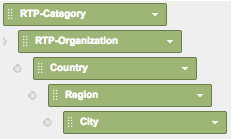
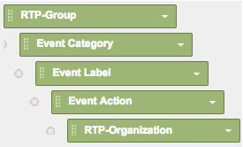

# Anpassade RTP-rapporter i Google Universal Analytics {#custom-rtp-reports-in-google-universal-analytics}

>[!PREREQUISITES]
>
>[Integrera RTP med Google Universal Analytics](/help/marketo/product-docs/web-personalization/reporting-for-web-personalization/web-analytics-integrations/integrate-rtp-with-google-universal-analytics.md)

I den här artikeln beskrivs hur du konfigurerar anpassade RTP-rapporter för Google Universal Analytics (GUA).  Data som skickas från RTP till GUA kan ställas in som två separata anpassade rapporter som kallas:

* RTP B2B
* RTP-engagemang

## Konfigurera en anpassad rapport {#setting-up-a-custom-report}

1. Logga in på Google Analytics.

1. Klicka på **Anpassning** i den övre menyn.

1. Klicka **+Ny anpassad rapport**.

## RTP B2B-rapport {#rtp-b-b-report}

1. Namnge rapporten **RTP B2B-rapport**.

1. Namnge den första fliken **Bransch**.

>[!NOTE]
>
>Du kommer att **Duplicera den här fliken** och skapa andra liknande - steg 5)

1. Välj **Utforskaren** rapporttyp.

   

1. I **Måttgrupper** väljer du de mätvärden som är relevanta för ditt företag.

   a. Vi rekommenderar följande:

   

1. Duplicera den här fliken fyra gånger och namnge dem:

   1. **Bransch**
   1. **Grupp**
   1. **Kategori**
   1. **ABM**
   1. **Organisationer**

   

1. I **Dimension - nedladdningar** anger de relevanta måtten för varje flik enligt nedan.

<table> 
 <thead> 
  <tr> 
   <th> 
    

      Fliknamn 
    
</th> 
   <th> 
    

      Dimension - nedladdningar
    
</th> 
  </tr> 
 </thead> 
 <tbody> 
  <tr> 
   <td>Bransch</td> 
   <td></td> 
  </tr> 
  <tr> 
   <td>Grupp</td> 
   <td></td> 
  </tr> 
  <tr> 
   <td>Kategori</td> 
   <td></td> 
  </tr> 
  <tr> 
   <td>ABM</td> 
   <td></td> 
  </tr> 
  <tr> 
   <td>Organisationer</td> 
   <td></td> 
  </tr> 
 </tbody> 
</table>

1. Ange inga filter och ställ in den här rapporten som tillgänglig för **Alla webbplatsdata** (eller ändra om det är relevant för det specifika Analytics-kontot).

1. Klicka **Spara**.

   

## RTP-engagemangsrapport {#rtp-engagement-report}

1. Namnge rapporten **RTP-engagemangsrapport**.

1. Ange det första fliknamnet till **Alla engagemang**.

>[!NOTE]
>
>Du kommer att duplicera den här fliken och skapa andra liknande - steg 5)

1. Välj **Utforskaren** rapporttyp.

   

1. I avsnittet Måttgrupper väljer du de mått som är relevanta för ditt företag. Här är en rekommendation:

   

1. Duplicera den här fliken fyra gånger och namnge dem:

   1. **Alla engagemang**
   1. **Engagemang per bransch**
   1. **Engagemang per grupp**
   1. **Engagemang efter kategori**
   1. **Åtagande av ABM**

   

1. I **Dimension - nedladdningar** anger du de relevanta måtten för varje flik enligt nedan:

<table> 
 <thead> 
  <tr> 
   <th> 
    

      Fliknamn 
    
</th> 
   <th> 
    

      Dimension - nedladdningar 
    
</th> 
  </tr> 
 </thead> 
 <tbody> 
  <tr> 
   <td>Alla engagemang</td> 
   <td></td> 
  </tr> 
  <tr> 
   <td>Åtagande av ABM</td> 
   <td></td> 
  </tr> 
  <tr> 
   <td>Engagemang efter kategori</td> 
   <td></td> 
  </tr> 
  <tr> 
   <td>Engagemang per grupp</td> 
   <td></td> 
  </tr> 
  <tr> 
   <td>Engagemang per bransch</td> 
   <td></td> 
  </tr> 
 </tbody> 
</table>

1. Ange följande filter:

<table> 
 <thead> 
  <tr> 
   <th> 
    

      Inc/Exc 
    
</th> 
   <th> 
    

      Fält 
    
</th> 
   <th> 
    

      Matcha typ 
    
</th> 
   <th> 
    

      Värden 
    
</th> 
   <th colspan="1"> 
    

      Kommentarer 
    
</th> 
  </tr> 
 </thead> 
 <tbody> 
  <tr> 
   <td>
Inkludera
</td> 
   <td>
Händelsekategori
</td> 
   <td>Regex</td> 
   <td>RTP-Campaigns|RTP-Recommendations|RTP-Segments</td> 
   <td colspan="1">Filtrerar alla andra anpassade händelser som inte är relaterade till RTP</td> 
  </tr> 
  <tr> 
   <td>Exkludera</td> 
   <td>Händelseetikett</td> 
   <td>Regex</td> 
   <td>#</td> 
   <td colspan="1">Gör att du kan filtrera från din rapportkampanj med # i kampanjnamnet</td> 
  </tr> 
 </tbody> 
</table>

1. Ange att den här rapporten ska vara tillgänglig för **Alla webbplatsdata** (eller ändra vid behov).

   

1. Klicka **Spara**.

>[!MORELIKETHIS]
>
>[Integrera RTP med Google Universal Analytics](/help/marketo/product-docs/web-personalization/reporting-for-web-personalization/web-analytics-integrations/integrate-rtp-with-google-universal-analytics.md)
>
>[Anpassade RTP-instrumentpaneler i Google Universal Analytics](/help/marketo/product-docs/web-personalization/reporting-for-web-personalization/web-analytics-integrations/custom-rtp-dashboards-in-google-universal-analytics.md)
