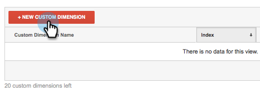
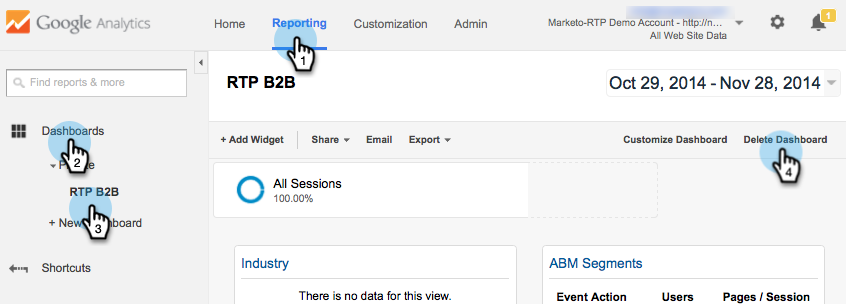

# Integrera RTP med Google Universal Analytics {#integrate-rtp-with-google-universal-analytics}

## Intro {#intro}

Utnyttja Google Universal Analytics (GUA) med bekräftande data och personaliseringsdata från Marketo Real-Time Personalization (RTP) för att bättre mäta och analysera era webbmarknadsföringsinsatser.

I det här inlägget beskrivs hur du konfigurerar och integrerar Marketo Real-Time Personalization-plattformen (RTP) med Google Universal Analytics-konton (GUA). RTP-data kan läggas in i ditt GUA-konto så att du kan se resultatet för organisationer, branscher, företagsgrafik och RTP-segment som besöker din webbplats.

**Google Universal Analytics**

Google Universal Analytics med RTP:s data ger er en bättre förståelse för hur B2B-användare interagerar med ert onlineinnehåll och hjälper er att mäta och få bättre resultat av era personaliseringskampanjer. [Läs mer om Google Universal Analytics](https://support.google.com/analytics/answer/2790010/?hl=en&amp;authuser=1).

>[!NOTE]
>
>**Endast för Google Tag Manager-användare**
>
>Ingen kodning eller specialkonfiguration behöver göras. Se till att du slutför följande checklista:
>
>* RTP-dimensioner skapas i Google Universal Analytics
>* [RTP-taggen är korrekt installerad i Google Tag Manager](https://docs.marketo.com/display/public/DOCS/Implementing+RTP+using+Google+Tag+Manager)
>* Integrering med Google Universal Analytics är aktiverat i RTP:s kontoinställningar
>* [Taggen Google Universal Analytics är korrekt konfigurerad i Google Tag Manager](https://support.google.com/tagmanager/answer/6107124?hl=en)
>* [Taggen Google Tag Manager är korrekt installerad på webbplatsen](https://developers.google.com/tag-manager/quickstart)

## Konfigurera anpassade Dimensioner i GUA {#set-up-custom-dimensions-in-gua}

1. I GOOGLE ANALYTICS

   1. Gå till **Admin**
   1. Välj **kontot.**
   1. Välj egenskapen **.**
   1. Välj **Anpassade definitioner** och **Anpassade Dimensioner**.

      

1. Lägg till en ny anpassad dimension. Klicka på **+Ny anpassad Dimension**

   

1. Lägg till följande **anpassade Dimensioner:**

<table> 
 <tbody> 
  <tr> 
   <td>
<strong>Namn på anpassad Dimension</strong>
</td> 
   <td>
<strong>Omfång</strong>
</td> 
   <td>
<strong>Aktiv</strong>
</td> 
  </tr> 
  <tr> 
   <td>
<strong>RTP-organisation</strong>
</td> 
   <td>
Session
</td> 
   <td>
✓
</td> 
  </tr> 
  <tr> 
   <td>
<strong>RTP-Bransch</strong>
</td> 
   <td>
Session
</td> 
   <td>
✓
</td> 
  </tr> 
  <tr> 
   <td>
<strong>RTP-kategori</strong>
</td> 
   <td>
Session
</td> 
   <td>
✓
</td> 
  </tr> 
  <tr> 
   <td>
<strong>RTP-grupp</strong>
</td> 
   <td>
Session
</td> 
   <td>
✓
</td> 
  </tr> 
 </tbody> 
</table>

>[!NOTE]
>
>**Namn på anpassade Dimensioner** måste vara exakt som de definieras i tabellen ovan (annars visas inte anpassade RTP-instrumentpaneler och rapporter i GUA korrekt)

1. Lägg till **namnet**. Välj scopet som **session**. Klicka på **Skapa**.

   

Listan Anpassad Dimension bör se ut så här.

När du har aktiverat anpassade Dimensioner i GUA går du till RTP-plattformen för att aktivera de här dimensionerna i RTP.

## Aktivera GUA-integreringen i ditt RTP-konto {#activate-the-gua-integration-in-your-rtp-account}

1. Gå till **Kontoinställningar i RTP-plattformen.**

   

1. Klicka på **Domän** under **Kontoinställningar**.
1. Klicka på **Google Universal Analytics** under **Analytics**.
1. Aktivera **På** de relevanta anpassade Dimensionerna och händelserna för att lägga till dessa data från RTP till Google Universal Analytics.
1. Ange **indexnumret** för dimensionen justerad mot indexnumret i GUA.
1. Klicka på **Spara**.

>[!NOTE]
>
>Indexnumret för Dimensionen Custom finns i GUA under Custom Dimensions.
>
>Exempel: RTP-Industry Index Number är lika med 1, RTP-Organization Index Number är lika med 2.

## Ta bort gamla instrumentpaneler i Google Analytics {#remove-old-dashboards-in-google-analytics}

1. I Google Analytics. Gå till **rapportering.**
1. Klicka på **Instrumentpaneler.**
1. Välj en **instrumentpanel** (RTP B2B- eller RTP-prestanda)
1. Klicka på **Ta bort instrumentpanel**.

