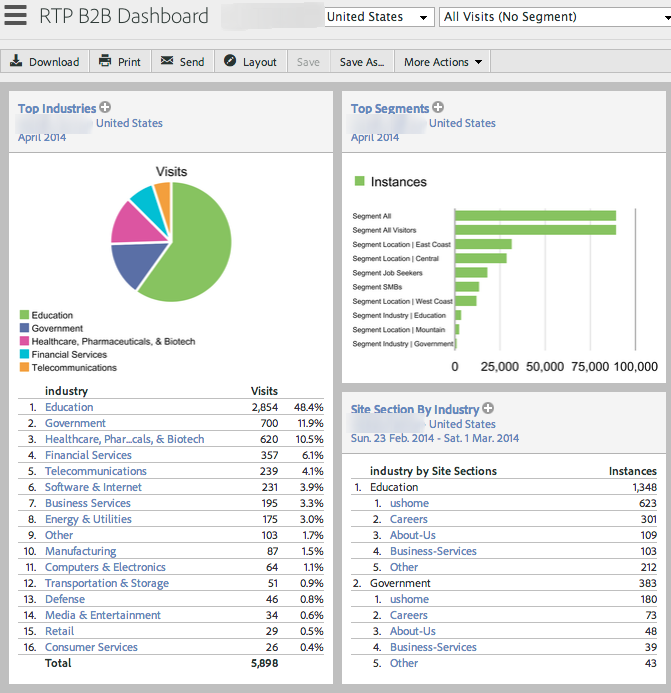
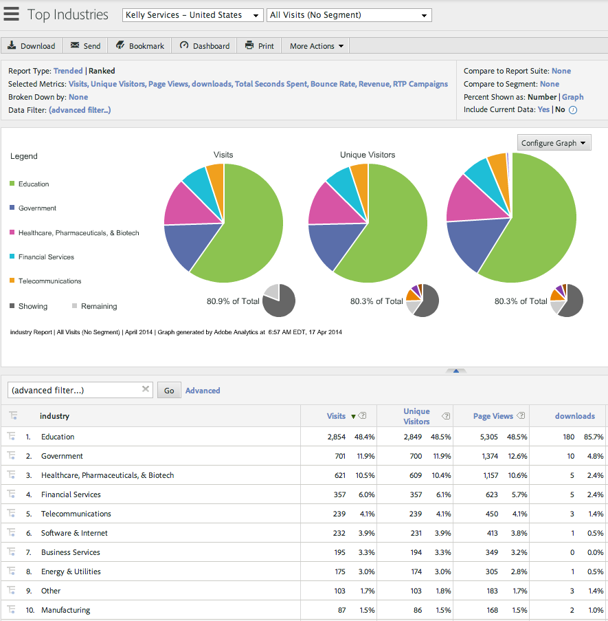
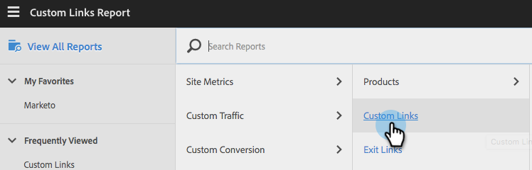

# Integrera med Adobe Analytics {#integrate-with-adobe-analytics}

## Intro {#intro}

Analysera webbanalysen utifrån B2B-perspektiv genom att visa kampanjdata för organisation, bransch och Marketo Real-Time Personalization (RTP) på ditt Adobe Analytics-konto.

Det här dokumentet möjliggör integrering mellan Marketo Real-Time Personalization (RTP) och Adobe Adobe Analytics. Med hjälp av data från RTP kan ni identifiera och analysera trender i alla branschsegment och organisationer som besöker er webbplats och mäta effektiviteten i era RTP-kampanjer, och få insikter och analyser för att få optimala resultat.

Ni kan uppnå detta genom att titta på mätvärden som antalet nya jämfört med återkommande besökare i varje segment, analysera klickfrekvenser på kampanjer och identifiera vilka branscher och anpassade segment och realtidskampanjer som genererade de bästa konverteringsleads. Utnyttja den här möjligheten för att få ut maximalt av ditt RTP-konto.

## RTP Audience Analytics {#rtp-audience-analytics}

Med RTP - AA-integrering får du en ny dimension i webbanalysgränssnittet. RTP förbättrar automatiskt instrumentpanelerna för webbanalys med:

1. Organisations- och branschdata
1. Anpassade RTP-segment
1. Namngivna kontolistor (kontobaserad marknadsföring)

Detta förbättrar era B2B-data och gör att ni kan fokusera på relevanta besökare genom att optimera:

1. Utgående kanaler
1. Innehåll
1. Återmarknadsföring

## Kanalrapport {#channel-report}

RTP-instrumentpanelen hjälper dig att förstå hur besökarna delas upp efter vertikala linjer och RTP-segment. Ni kan se hur besökarna presterar utifrån branschen och olika marknadsföringskampanjer (betalda, organiska, sociala) som är relaterade till den branschen. Kontrollpanelen ger också en översikt på hög nivå över vilka avsnitt besökarna visar beroende på vilken typ av bransch de använder.

## Beteenderapport {#behavioral-report}

Olika beteenderapporter kan skapas i Adobe Analytics utifrån data om organisation, bransch och RTP-segment. Dessa flödesrapporter visualiserar den sökväg besökarna tar från en sida eller händelse till nästa. Den här rapporten kan hjälpa er att identifiera vilket innehåll som håller besökarna engagerade med er webbplats.

## RTP-prestanda {#rtp-performance}

Visa visningar och konverteringar för RTP-kampanjer under Anpassade länkar i Adobe Analytics.

Denna Custom Link-rapport visar visningar och konverteringar av kampanjer i följande namnformat:

* Impression ISegment: [RTP-segmentnamn], ICampaign: [RTP-kampanjnamn]
* Konvertering av ISegment: [RTP-segmentnamn], ICampaign: [RTP-kampanjnamn]

## Konfigurera i Adobe Analytics {#set-up-in-adobe-analytics}

Integreringen använder det JavaScript-API som finns i Adobe Analytics. Anpassade konverteringsvariabler (eVar), anpassade händelser (händelse) och trafikvariabler används i integreringen. Alla måste aktiveras inifrån en AA-administratör. Du måste ange konverteringsvariabler, anpassade händelser och trafikvariabler i annars kan du inte se data i sviten även om du aktiverat den i RTP.

Gör så här för att konfigurera dessa variabler i AA:

1. Gå till **Admin Tools** i ditt AA-konto.
1. Välj **Report Suite** som ska användas med integreringen.
1. Under **Redigera inställningar,** går du till **Konvertering** och väljer ** [Konverteringsvariabler](http://microsite.omniture.com/t2/help/en_US/reference/#Edit_conversion_variables)**.\
   Välj [Konverteringsvariabel](http://microsite.omniture.com/t2/help/en_US/reference/#Conversion_Variables_eVar) (vi rekommenderar):

   1. 

      1. Evar # 20 for Industry Custom Conversions
      1. Evar # 21 for Organization Custom Conversions

         >[!NOTE]
         >
         >Välj ett annat tillgängligt nummer om du väljer #. Justera det här numret mot platsnumret i RTP-kontoinställningarna.

      1. Ändra status till* aktiverat*

         1. Ändra namn till **Bransch** och **Organisation**. (Så här kommer det att se ut i Report Suite.)

         1. Ändra fältet Förfaller efter till **Besök.**

1. Under **Redigera inställningar **går du till** Konvertering **och väljer ** [Slutförda händelser](http://microsite.omniture.com/t2/help/en_US/reference/#Configure_success_events)**.

1. Välj ett anpassat händelsenummer för lyckade händelser (vi rekommenderar):

   1. event20 för RTP-kampanjer
   1. event21 för RTP-segment

      >[!NOTE]
      >
      >Välj ett annat tillgängligt nummer om du väljer #. Justera det här numret mot platsnumret i RTP-kontoinställningarna.

   1. Ändra de två händelsenamnen till **RTP-kampanjer** och **RTP-segment**. Det här namnet visas i rapportsviten.

1. Välj fältet Typ* *som **Räknare (inga underrelationer)**

1. Under **Redigera inställningar** går du till ** [Trafik](http://microsite.omniture.com/t2/help/en_US/reference/#Traffic_Variable) **och väljer ** [Trafikvariabler](http://microsite.omniture.com/t2/help/en_US/reference/#Enable_traffic_variable_reports)**.

   1. Välj egenskapsnumret för trafikvariabeln (vi rekommenderar):

      1. Egenskap nr 20 - Namn: RTP-segmentorganisation
      1. Egenskap nr 21 - Namn: RTP-segmentindustri
      1. Egenskap nr 25 - Namn: Kampanjorganisation
      1. Egenskap nr 26 - Namn: RTP Campaign Industry

         >[!NOTE]
         >
         >Välj ett annat tillgängligt nummer om du väljer #. Justera det här numret mot platsnumret i RTP-kontoinställningarna)

      1. Ändra egenskapsnamnen för 4. Det här namnet visas i rapportsviten.
   1. Välj Aktiverat fält till **Aktiverat**
   1. Välj fältet Sökvägsrapporter till **Aktiverad**

## Konfigurera i Marketo Real-Time Personalization (RTP) {#set-up-in-marketo-real-time-personalization-rtp}

1. Gå till **Kontoinställningar** i RTP-plattformen.

   

1. Klicka på **Domän** under **Kontoinställningar**.
1. Klicka på&#x200B;**** Adobe Analytics **under** Analytics.
1. Aktivera **På **Variabeln Konvertering, Anpassad och Trafik växlar.
1. Tilldela konversion-, händelse- och trafikvariablerna **platsnummer** så att de matchar platsnumren som skapas i AA
1. Klicka på **SPARA**.

>[!NOTE]
>
>Våra rekommenderade inställningar för kortplatser är
>
>**Konverteringsvariabler**
>
>* Anpassade branschkonverteringar - fack 20
>* Anpassade organisationskonverteringar - plats 21

>
>
**Anpassade händelser**
>
>* Anpassad kampanjhändelse - kortplats 20
>* Anpassad händelse för segment - plats 21

>
>
**Trafikvariabler**
>
>* Segmentorganisationstrafikvariabel - fack 20
>* Segmentbranschens trafikvariabel - fack 21
>* Trafikvariabel för kampanjorganisation - kortplats 22
>* Trafikvariabel för kampanjbransch - kortplats 23

>
>
**Se till att platsnumren är justerade mot de variabler och händelsenummer som skapas i AA.**

## Rapporter {#reports}

Skapa förbättrade SiteAdobe Analytics-rapporter utifrån organisationsnamn, branscher och RTP-segment samt kampanjdata i realtid.

Exempel på anpassade rapporter och kontrollpaneler i AA är:

* Prestanda efter bransch eller definierat segment (kontobaserade namngivna listor)
* Branschanalys per nyckeltal
* Visa sidor per organisation
* Marknadsföringskanalernas prestanda enligt Organisation, Bransch, Segment

**Exempel på rapporter**

**Top Industries Report**

** 

**

**Organisationsrapport**

**Skapa RTP-instrumentpanelen**

Skapa en [ny instrumentpanel](http://microsite.omniture.com/t2/help/en_US/sc/user/t_dashboard_add.html) med namnet **RTP-instrumentpanel**. Den här instrumentpanelen hjälper dig att förstå hur besökarna delas upp efter vertikala linjer och RTP-segment.

1. Klicka på **Kontrollpanel,** klicka** Lägg till kontrollpanel**

1. Namnge instrumentpanelen **RTP-instrumentpanelen**
1. Välj storleken **på kontrollpanelen** 3 x 2, 2 x 2
1. Skapa [rapportleten](http://microsite.omniture.com/t2/help/en_US/sc/user/t_dashboard_add_report.html#task_EC3AFBBAA51C45CEBAF632F841C305B3) och lägg till [innehåll på kontrollpanelen](https://docs.marketo.com/Add%2520content%2520to%2520a%2520dashboard)

Lägga till branschrapporten på kontrollpanelen

1. Gå till **Anpassade konverteringar**, klicka på **Bransch**

1. Konfigurera diagrammet till **cirkeldiagram**
1. Klicka på **Dashboard**, lägg till **Report**

1. Namnge rapporten **Top Industries**
1. Placera i instrumentpanelen **RTP-instrumentpanel**
1. Skapa **Nytt**.

Lägga till segmentrapporten på kontrollpanelen

1. Gå till **Webbplatsstatistik, **Klicka på **Anpassade händelser, segment**

1. Konfigurera diagrammet till **Lodrätt fält**
1. Klicka på **Dashboard**, lägg till **Report**

1. Namnge rapporten **Top Segments**
1. Placera i instrumentpanelen **RTP-instrumentpanel**
1. Skapa **Nytt.**

Dina rapporter visas på kontrollpanelen.

## Visa Impressions and Clicks (Conversions) i Adobe Analytics {#view-impressions-and-clicks-conversions-in-adobe-analytics}

1. Klicka på Egna länkar.

   

1. Sök efter Impressions för att visa segmenterings- och kampanjnamn som representerar antalet visningar för kampanjen.\
   

1. Sök efter konvertering om du vill visa segment- och kampanjnamn som representerar antalet klick för kampanjen.

   

