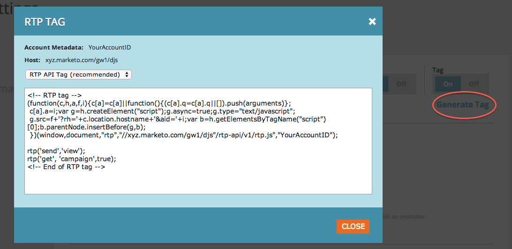

# Implementera RTP på Marketo landningssidor {#implementing-rtp-on-marketo-landing-pages}

Följ installationsanvisningarna nedan för att implementera RTP-taggen:

1. Gå till **Design Studio.** Öppna det objekt som du vill redigera. Välj **Mallåtgärder**, markera **Redigera utkast**.

   

1. Gör malländringar på **HTML-källa** -fliken.

   

1. Gå till ditt RTP-konto **Kontoinställningar**.

   a. Om du redan har fått din JavaScript-tagg från Support fortsätter du till steg 5.

   

1. Under Domän letar du reda på den relevanta domänen och klickar på **Generera tagg**.

   

   

1. Kopiera JavaScript-taggen RTP och klistra in den i alla dina startsidmallar mellan **`<head> </head>`** -taggar.

1. Klicka **Spara** och **Stäng** fönstret.

1. Tillbaka i **Design Studio**, godkänna landningssidan från **Mallåtgärder**, klicka **Godkänn**.

   

1. Slutligen måste ni **omgodkänna** Eventuella landningssidor som använder den mallen för att ändringarna av mallen ska börja gälla. Du kan omgodkänna alla sidor på en gång i huvudsektionen Landing Pages.

   

1. Kontrollera att den visas på alla sidor, inklusive landningssidor och underdomäner.

   Du kan göra detta genom att högerklicka på webbplatsens sida. Gå till **Visa sidkälla.** Sök efter **RTP** för att hitta taggen.
